# Database Design (Inferred From Current Codebase)

This schema is based on the current app data structures in `src/lib/*`, `src/hooks/*`, and `src/pages/*`.

## Visual ERD

```mermaid
erDiagram
    USERS ||--|| USER_PROFILES : has
    USERS ||--o{ USER_ROLES : assigned
    ROLES ||--o{ USER_ROLES : maps

    USERS ||--o{ EVENT_REGISTRATIONS : registers
    EVENTS ||--o{ EVENT_REGISTRATIONS : accepts

    USERS ||--o{ USER_PROGRAM_MEMBERSHIPS : joins
    PROGRAMS ||--o{ USER_PROGRAM_MEMBERSHIPS : has

    USERS ||--o{ USER_ORG_MEMBERSHIPS : joins
    ORGANIZATIONS ||--o{ USER_ORG_MEMBERSHIPS : has

    BARANGAYS ||--o{ PROGRAMS : hosts
    BARANGAYS ||--o{ EVENTS : hosts
    BARANGAYS ||--o{ ORGANIZATIONS : based_in

    BARANGAYS ||--o{ BARANGAY_FINANCIALS : tracks
    BARANGAYS ||--o{ COMPLIANCE_BOARD_STATUS : tracks
    BARANGAYS ||--o{ MONTHLY_COMPLIANCE : tracks

    OFFICES ||--o{ DISCLOSURE_DOCUMENTS : publishes
    BARANGAYS ||--o{ DISCLOSURE_DOCUMENTS : scoped_to

    DISCLOSURE_DOCUMENTS ||--o{ DOCUMENT_DOWNLOADS : downloaded
    USERS ||--o{ DOCUMENT_DOWNLOADS : performs

    CITIZEN_TICKETS }o--|| TICKET_TYPES : typed_as
    USERS ||--o{ CITIZEN_TICKETS : optionally_created_by

    SERVICE_ADVISORIES }o--|| OFFICES : posted_by

    USERS {
      uuid id PK
      varchar email UK
      varchar display_name
      timestamptz created_at
      timestamptz updated_at
    }

    USER_PROFILES {
      uuid user_id PK,FK
      varchar full_name
      varchar contact_number
      varchar municipality
      uuid barangay_id FK
      text bio
      boolean notifications
      boolean show_email_public
      timestamptz updated_at
    }

    ROLES {
      smallint id PK
      varchar code UK
    }

    USER_ROLES {
      uuid user_id FK
      smallint role_id FK
      timestamptz assigned_at
    }

    BARANGAYS {
      uuid id PK
      varchar name UK
      varchar sk_chairperson
      integer youth_population
    }

    OFFICES {
      uuid id PK
      varchar name UK
    }

    PROGRAMS {
      uuid id PK
      varchar slug UK
      varchar title
      varchar sector
      text description
      date start_date
      date end_date
      varchar schedule_text
      varchar location
      uuid barangay_id FK
      varchar source_post_url
      timestamptz created_at
    }

    EVENTS {
      uuid id PK
      varchar slug UK
      varchar title
      varchar sector
      text description
      date event_date
      varchar time_text
      varchar location
      uuid barangay_id FK
      varchar status
      varchar source_post_url
      timestamptz created_at
    }

    ORGANIZATIONS {
      uuid id PK
      varchar slug UK
      varchar name
      varchar type
      varchar focus
      varchar source_tag
      varchar status
      uuid barangay_id FK
      varchar source_post_url
      timestamptz created_at
    }

    EVENT_REGISTRATIONS {
      uuid id PK
      uuid user_id FK
      uuid event_id FK
      varchar full_name
      varchar email
      varchar contact_number
      varchar municipality
      uuid barangay_id FK
      varchar registration_status
      timestamptz registered_at
      timestamptz cancelled_at
    }

    USER_PROGRAM_MEMBERSHIPS {
      uuid user_id FK
      uuid program_id FK
      timestamptz joined_at
      timestamptz left_at
    }

    USER_ORG_MEMBERSHIPS {
      uuid user_id FK
      uuid organization_id FK
      timestamptz joined_at
      timestamptz left_at
    }

    DISCLOSURE_DOCUMENTS {
      uuid id PK
      varchar doc_code UK
      varchar title
      varchar document_type
      integer fiscal_year
      varchar quarter
      uuid barangay_id FK
      uuid office_id FK
      date published_date
      bigint file_size_bytes
      varchar pdf_url
      timestamptz created_at
    }

    DOCUMENT_DOWNLOADS {
      uuid id PK
      uuid document_id FK
      uuid user_id FK
      varchar ip_hash
      timestamptz downloaded_at
    }

    BARANGAY_FINANCIALS {
      uuid id PK
      uuid barangay_id FK
      integer fiscal_year
      integer month_no
      numeric allocated_amount
      numeric utilized_amount
      numeric sk_budget
      numeric remaining_amount
      numeric utilization_percent
      timestamptz updated_at
    }

    COMPLIANCE_BOARD_STATUS {
      uuid id PK
      uuid barangay_id FK
      integer fiscal_year
      varchar quarter
      varchar cbydp
      varchar abyip
      varchar annual_budget
      varchar rcb
      varchar mil
      varchar remarks
      timestamptz updated_at
    }

    MONTHLY_COMPLIANCE {
      uuid id PK
      uuid barangay_id FK
      integer fiscal_year
      integer month_no
      date due_date
      varchar mfr_status
      varchar mil_status
      varchar rcb_status
      varchar accomplishment_status
      varchar census_status
      varchar overall_status
      integer completion_percent
      varchar report_pdf_url
      timestamptz updated_at
    }

    TICKET_TYPES {
      smallint id PK
      varchar name UK
    }

    CITIZEN_TICKETS {
      uuid id PK
      varchar reference_no UK
      smallint type_id FK
      varchar subject
      text message
      varchar requester_email
      varchar status
      uuid created_by_user_id FK
      timestamptz created_at
      timestamptz updated_at
    }

    SERVICE_ADVISORIES {
      uuid id PK
      uuid office_id FK
      varchar title
      varchar status
      text message
      timestamptz updated_at
    }
```

## Notes

- Current app stores user auth/profile/tickets in localStorage; this schema is the server-ready version.
- `events`, `programs`, and `organizations` are modeled as separate tables to match page behavior.
- Compliance has two layers based on current pages:
  - Quarterly board (`COMPLIANCE_BOARD_STATUS`)
  - Monthly submissions (`MONTHLY_COMPLIANCE`)
- `BARANGAYS` and `OFFICES` are shared reference tables for consistency.
- Add unique constraints on membership tables:
  - `(user_id, program_id)`
  - `(user_id, organization_id)`
  - `(user_id, event_id)` on active registrations where `cancelled_at IS NULL`
