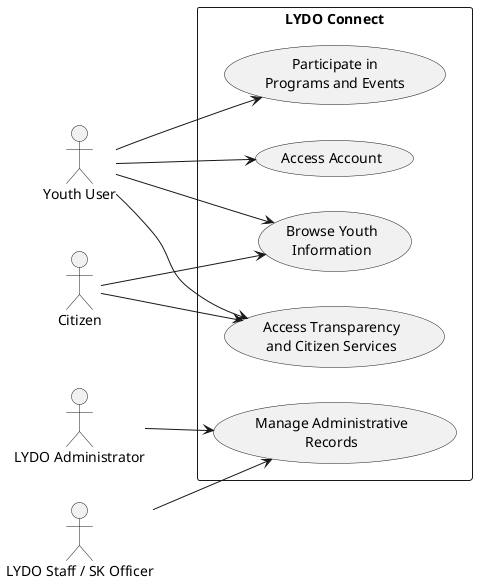
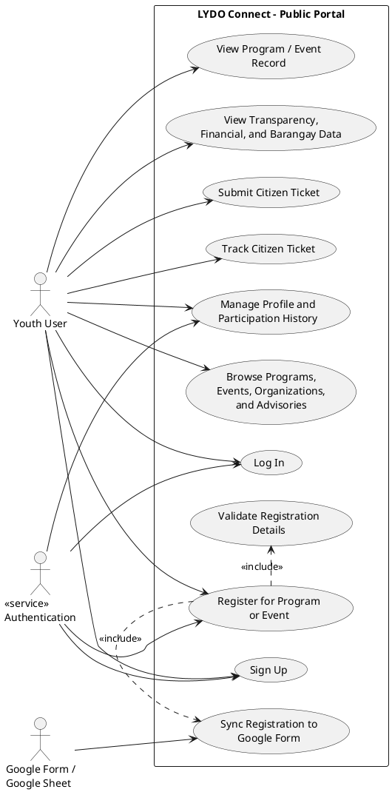
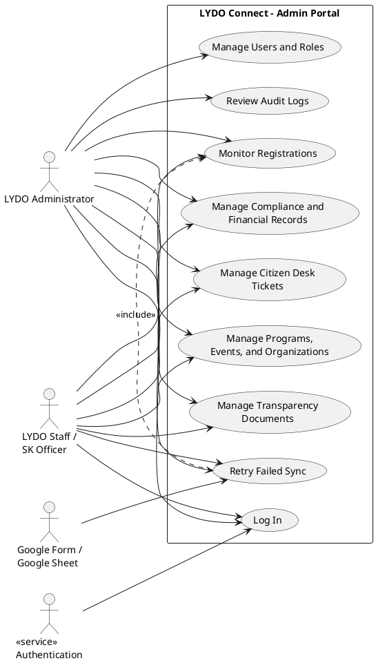

# 3.1.2 Use Case Diagram

Yes. For LYDO Connect, the use case diagrams can be presented in the same **classic UML use case style** as the sample, with:

- actors outside the system boundary;
- a rectangle representing the system;
- oval-shaped use cases inside the system; and
- `<<include>>` relations for dependent actions.

For documentation purposes, dividing the use case section into three figures is still better than placing everything in one crowded diagram. The figures below are written in **PlantUML-style UML notation** so they are easier to redraw in Word, Google Docs, or any UML tool.

## Figure 1. Overall Use Case Diagram of LYDO Connect

## Figure 2. Public User Use Case Diagram

## Figure 3. Admin Use Case Diagram

## Recommended Use in Your Manuscript

- Use **Figure 1** as the general use case diagram of the system.
- Use **Figure 2** as the public user use case diagram.
- Use **Figure 3** as the admin use case diagram.

If you are placing this in a Word document, these three are easier to recreate manually because they already follow the same UML arrangement as your sample image.
