# 3.1.2 Use Case Diagram

This section presents the updated UML use case diagram for the LYDO Connect System. The diagram is organized around four actors: **Public User**, **Youth User**, **LYDO Staff**, and **LYDO Super Admin**. It shows how public users can register and browse the public portal, how youth users can log in, manage their account, register for programs or events, track participation, and submit youth service requests, and how admin-side personnel manage portal content, programs, participation records, reports, service requests, user roles, and audit logs.

## Figure 1. General Use Case Diagram of LYDO Connect

## Diagram Notes

- The **Public User** can register an account and browse the public portal.
- The **Youth User** can log in, manage an account, register for programs or events, track participation, and submit service requests.
- The **LYDO Staff** can manage public portal content, programs/events, participation monitoring, participation records, reports, and youth service requests.
- The **LYDO Super Admin** can manage user accounts and roles and review audit logs.
- `<<include>>` relationships represent required supporting actions, such as authentication, validation, email verification, registration submission, participation history viewing, report data retrieval, and service request review.
- `<<extend>>` relationships represent optional or exception actions, such as two-factor authentication, login error, registration error, submission error, and status updates.
- The service desk workflow is scoped to youth service requests for LYDO Connect.
