# 3.1.2 Use Case Diagram

This section presents the use case diagrams of the major functions of LYDO Connect. The first figure shows the overall interaction of actors with the system, including selected planned future extensions, while the succeeding figures present the detailed use case diagrams corresponding to each use case report in Section 3.1.3. The detailed figures therefore follow a one-to-one relationship with `UC-01` to `UC-13`.

## Figure 1. Overall Use Case Diagram of LYDO Connect

## Figure 2. Use Case Diagram of Sign Up

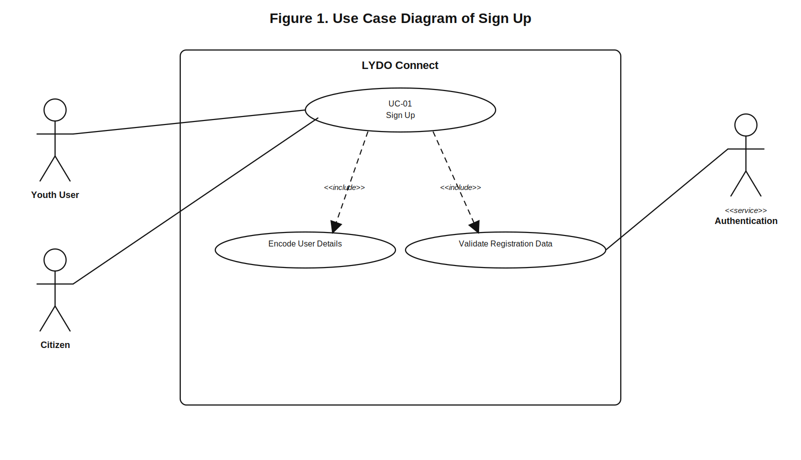

## Figure 3. Use Case Diagram of Log In

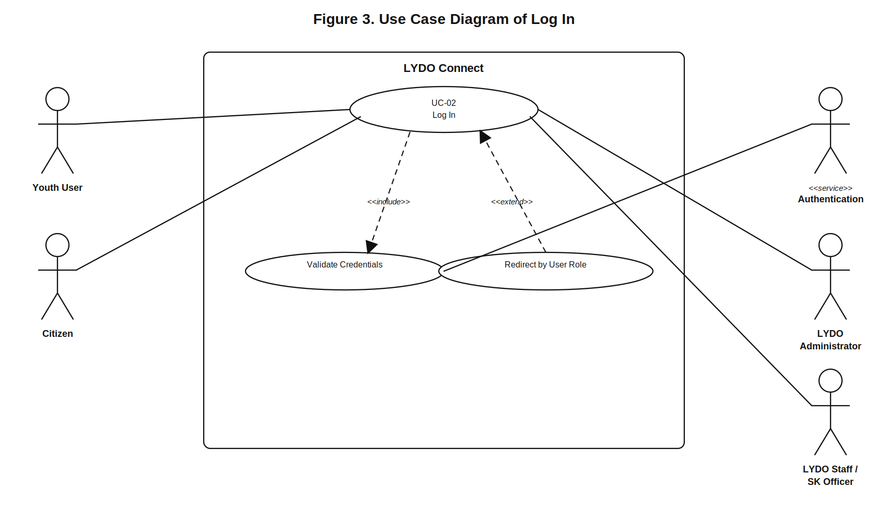

## Figure 4. Use Case Diagram of Browse and View Public Information

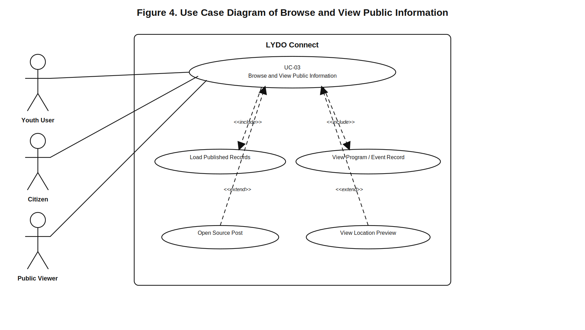

## Figure 5. Use Case Diagram of Register for Program or Event

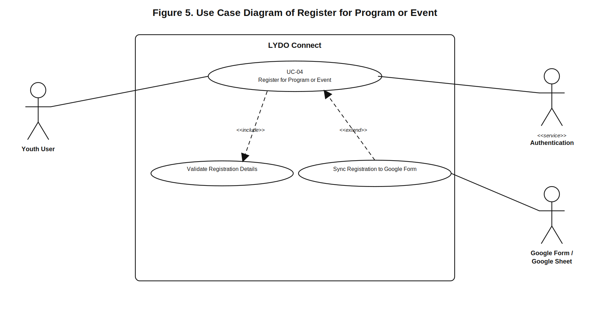

## Figure 6. Use Case Diagram of Manage Profile and Participation History

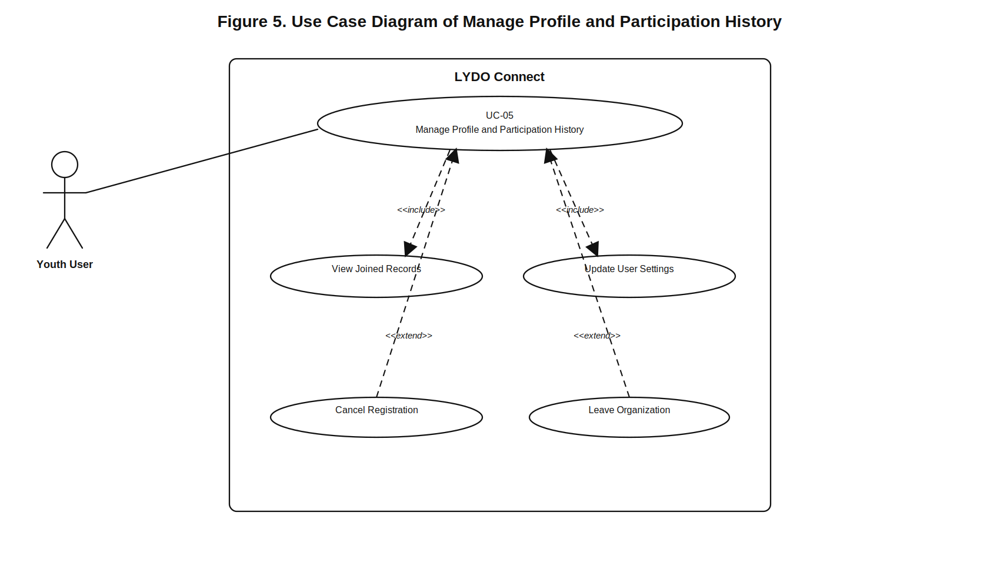

## Figure 7. Use Case Diagram of Submit and Track Citizen Ticket

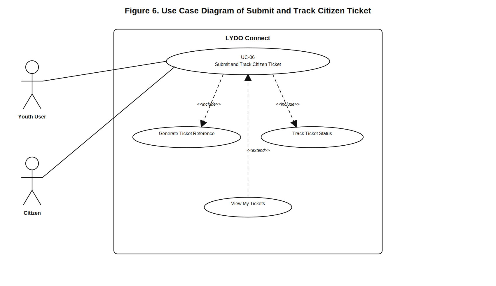

## Figure 8. Use Case Diagram of Manage Youth Records

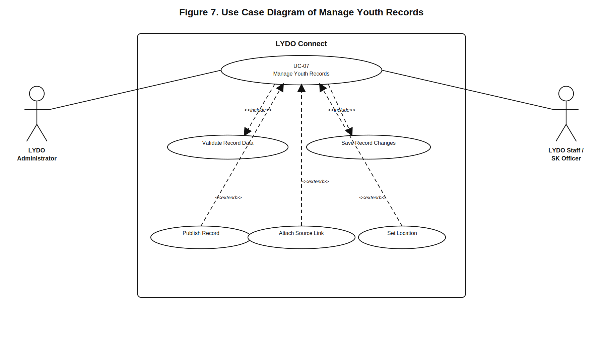

## Figure 9. Use Case Diagram of Manage Transparency and Financial Records

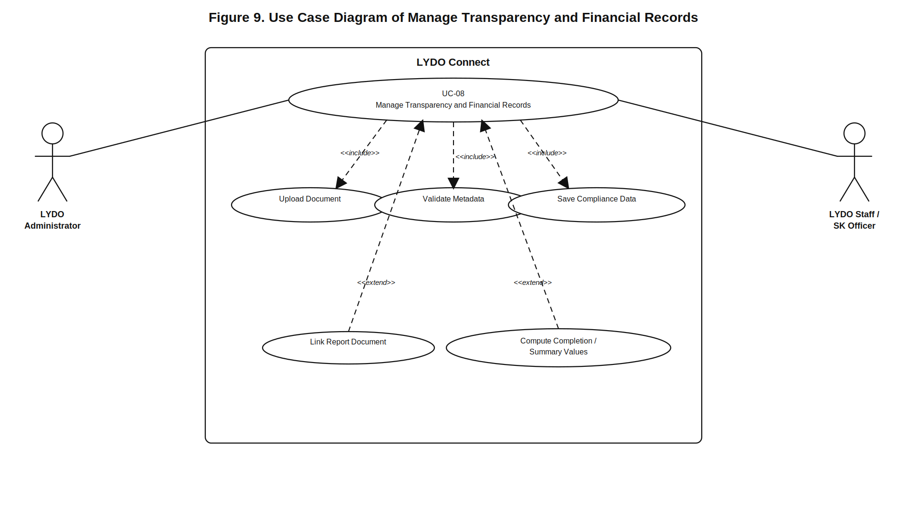

## Figure 10. Use Case Diagram of Monitor Registrations and Retry Sync

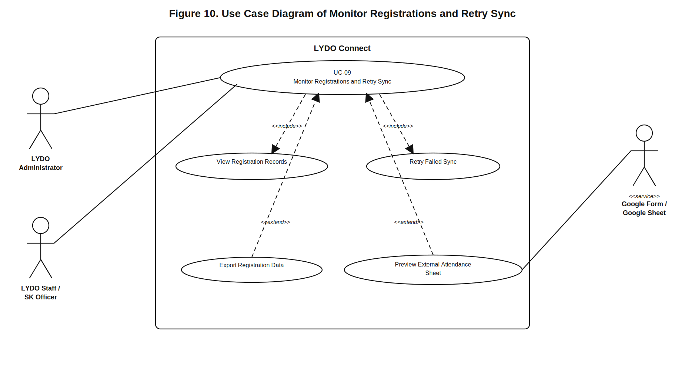

## Figure 11. Use Case Diagram of Manage Users, Roles, and Audit Logs

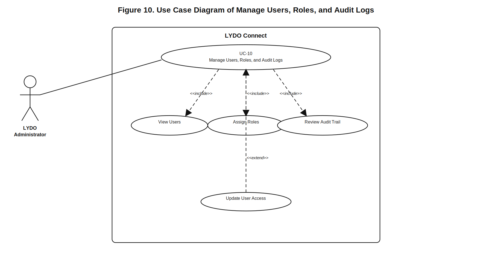

## Figure 12. Use Case Diagram of Analytics Dashboard

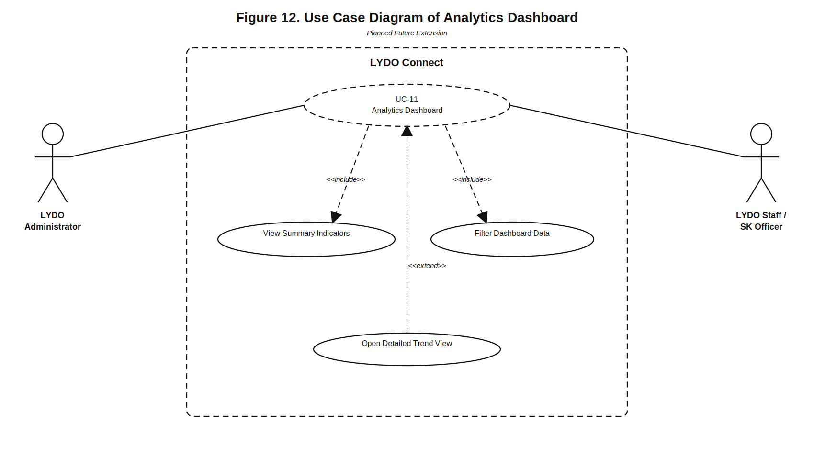

## Figure 13. Use Case Diagram of Manage Requests and Feedback

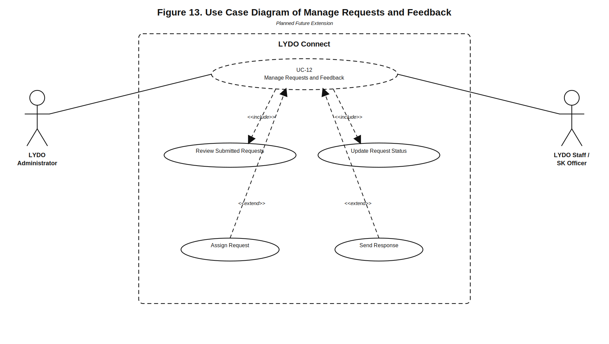

## Figure 14. Use Case Diagram of Notifications and Alerts

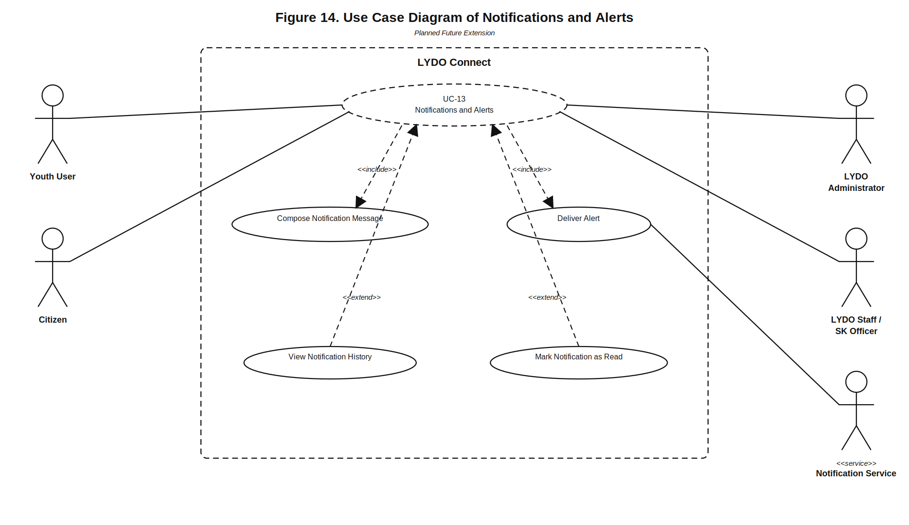

## Notes for Manuscript Use

- Figure 1 presents the overall scope of the system and also marks selected planned future extensions using dashed use cases.
- Figures 2 to 14 present the detailed diagrams aligned with the use case reports in Section 3.1.3.
- The files are stored as SVG so they remain sharp when inserted into Word.
- If your adviser wants exact numbering, replace the temporary figure numbers with your final manuscript numbering.
