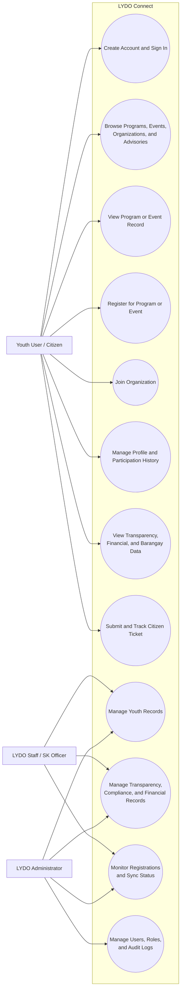
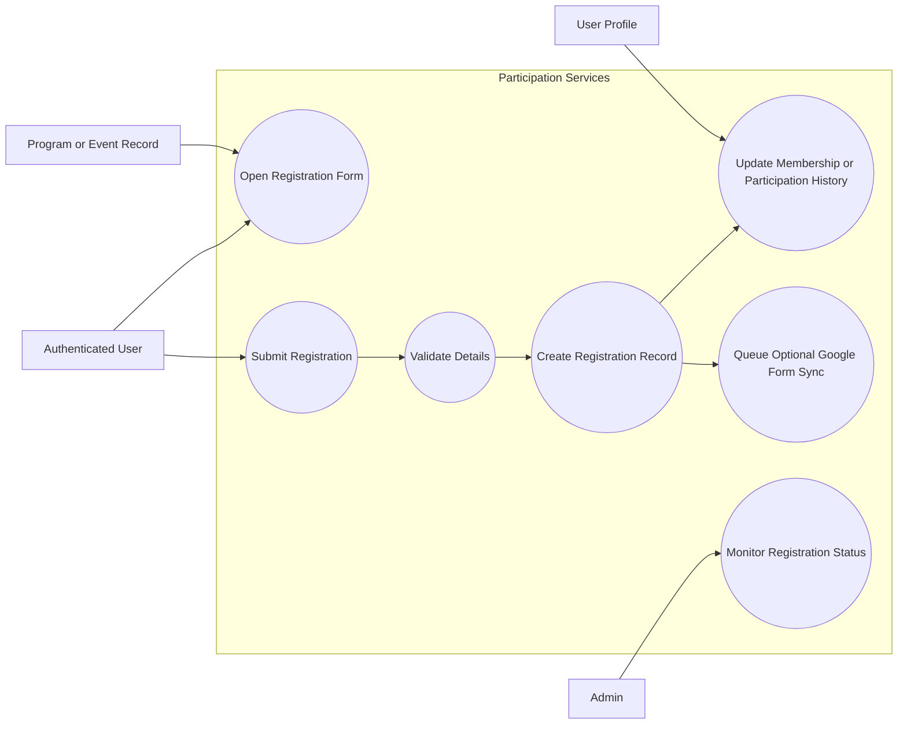

# 3.1.2 Use Case Diagram

The use case diagram presents the major interactions between the system and its primary actors. For LYDO Connect, this section is appropriate and necessary because the platform serves more than one user group and contains both public and administrative workflows.

## Main Use Case Diagram

## Focused Participation Use Case View

## Diagram Interpretation

- Public users interact mainly with information access, participation, ticketing, and profile services.
- Administrative users interact mainly with record management, compliance monitoring, registration oversight, and accountability controls.
- The participation flow is a core use case because it links program or event registration, profile updates, and optional external attendance synchronization.

## Appropriateness Note

The template's original use case diagrams for buying and selling virtual items are not suitable for this study. Replacing them with youth governance, transparency, and citizen service use cases is necessary for methodological consistency.
