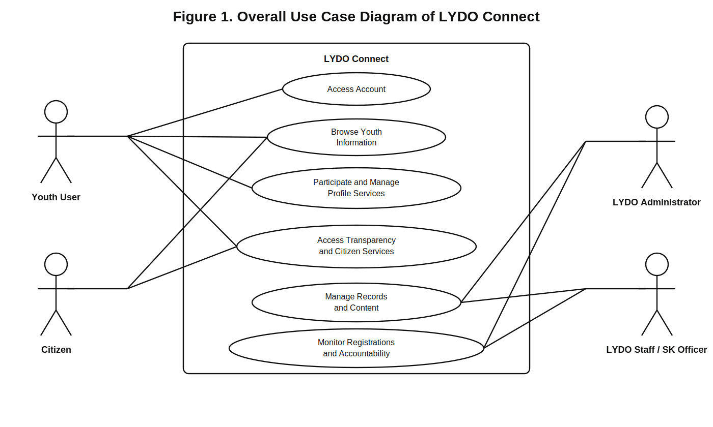
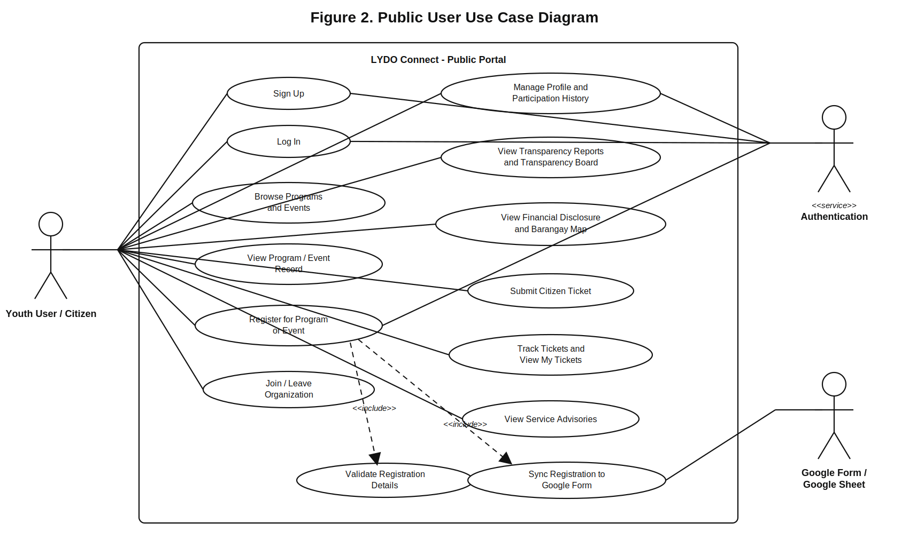
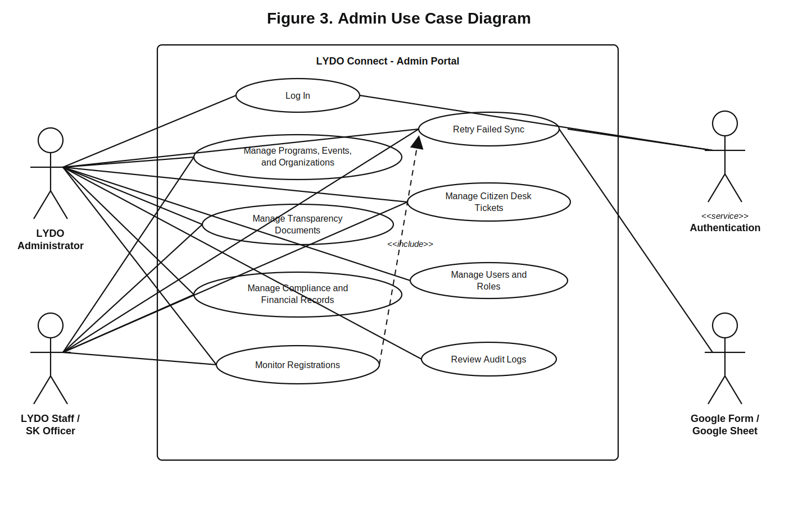

# 3.1.2 Use Case Diagram

The earlier version showed diagram source code because the Markdown viewer did not render PlantUML. This revised section now uses actual UML-style diagram files that can be viewed directly and inserted into a manuscript. The diagrams were also refined so that the main use cases correspond directly to the ten use case reports in Section 3.1.3.

## Figure 1. Overall Use Case Diagram of LYDO Connect

## Figure 2. Public User Use Case Diagram

## Figure 3. Admin Use Case Diagram

## Notes for Manuscript Use

- These are actual diagram files, not code blocks.
- The files are stored as SVG so they stay sharp when resized in Word.
- The main use cases in the diagrams are labeled `UC-01` to `UC-10` to match the use case reports.
- Figure 2 covers the public-side reports `UC-01` to `UC-06`.
- Figure 3 covers the admin-side reports `UC-02` and `UC-07` to `UC-10`.
- If needed, you can insert the SVG files directly from the `Methodology/diagrams` folder.
