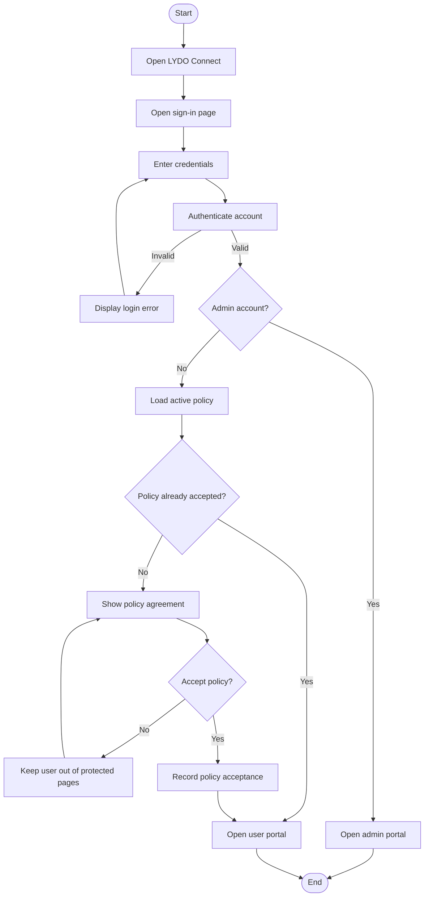
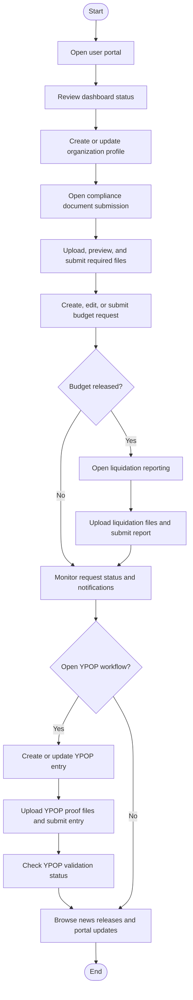
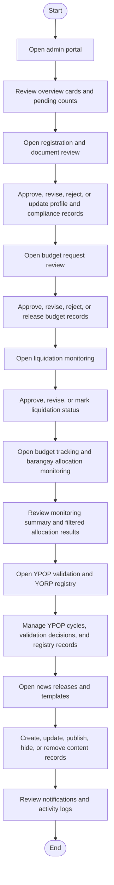

# 3.2.1 Activity Diagram

The activity diagrams show the major workflows that currently exist in LYDO Connect.

## Figure 6.1. Authentication and Policy Agreement

## Figure 6.2. User Workflow

## Figure 6.3. Admin Workflow

## Interpretation

- The current workflow is centered on authenticated organization-side operations and administrative review operations.
- Policy agreement remains a gating step for non-admin users after successful authentication.
- Organization users move from profile completion to compliance submissions, budget requests, liquidation reporting, YPOP processing, notifications, and news updates.
- Admin users move from overview monitoring to registration review, finance-related review, YPOP and YORP management, content maintenance, and audit-oriented monitoring.
- Budget tracking still includes released amounts and allocation summaries grouped by district and barangay.
