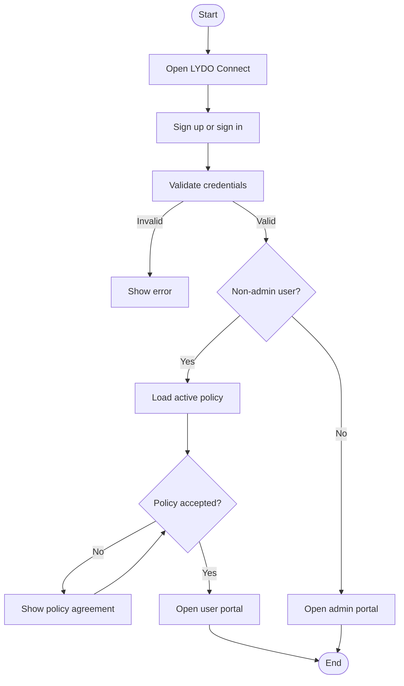
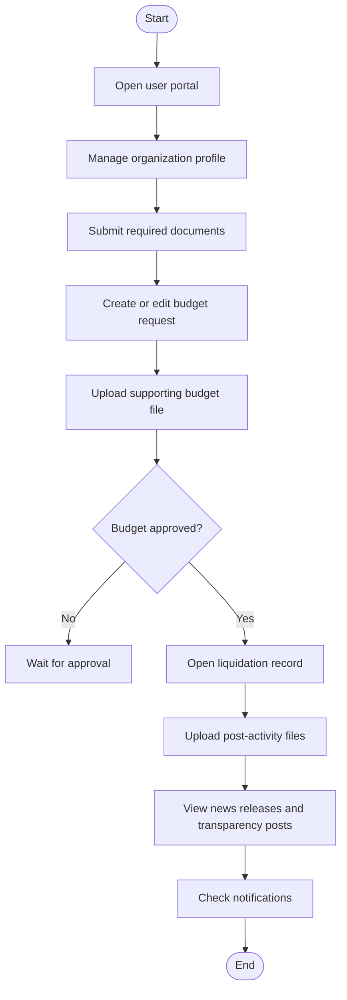
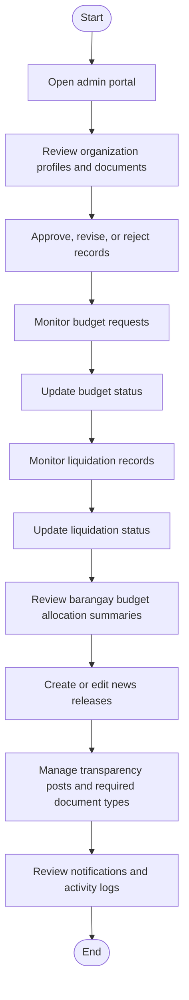

# 3.2.1 Activity Diagram

The activity diagrams show the major workflows that currently exist in LYDO Connect.

## Figure 6.1. Authentication and Policy Agreement

## Figure 6.2. User Workflow

## Figure 6.3. Admin Workflow

## Interpretation

- The current workflow is centered on authenticated user tasks and admin review tasks.
- Budget approval unlocks liquidation file uploads.
- Admin budget monitoring includes released amounts grouped by barangay and district.
- News releases are previewable before opening the Facebook source post.
- Transparency posts, required document types, notifications, and logs are maintained from the admin side.
