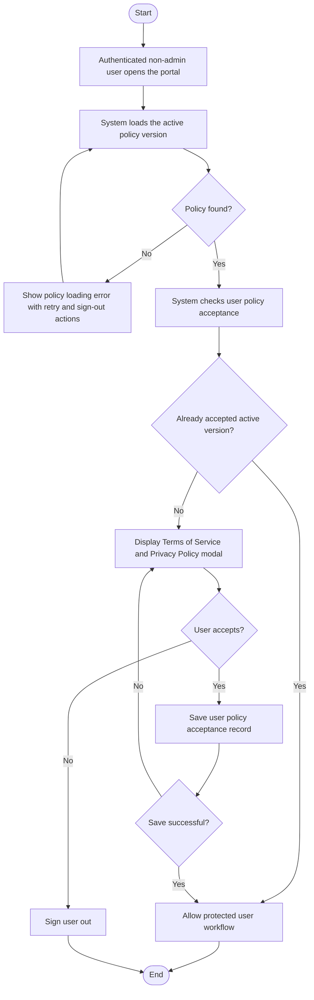
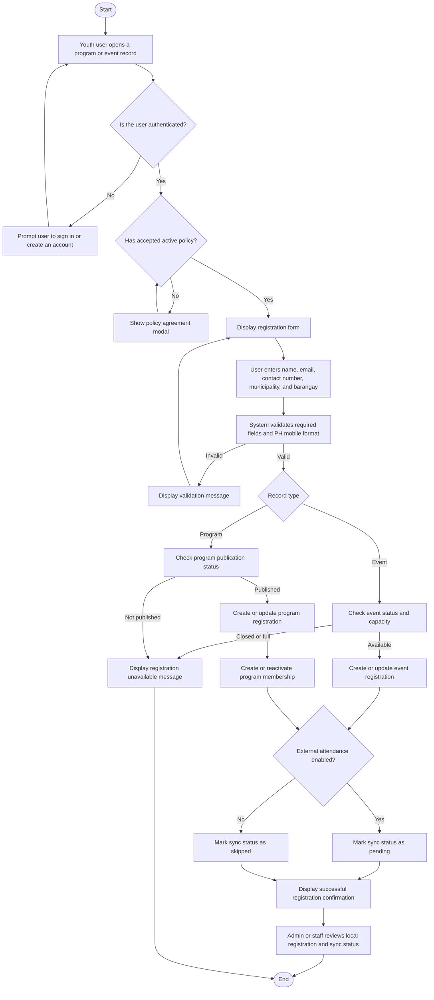
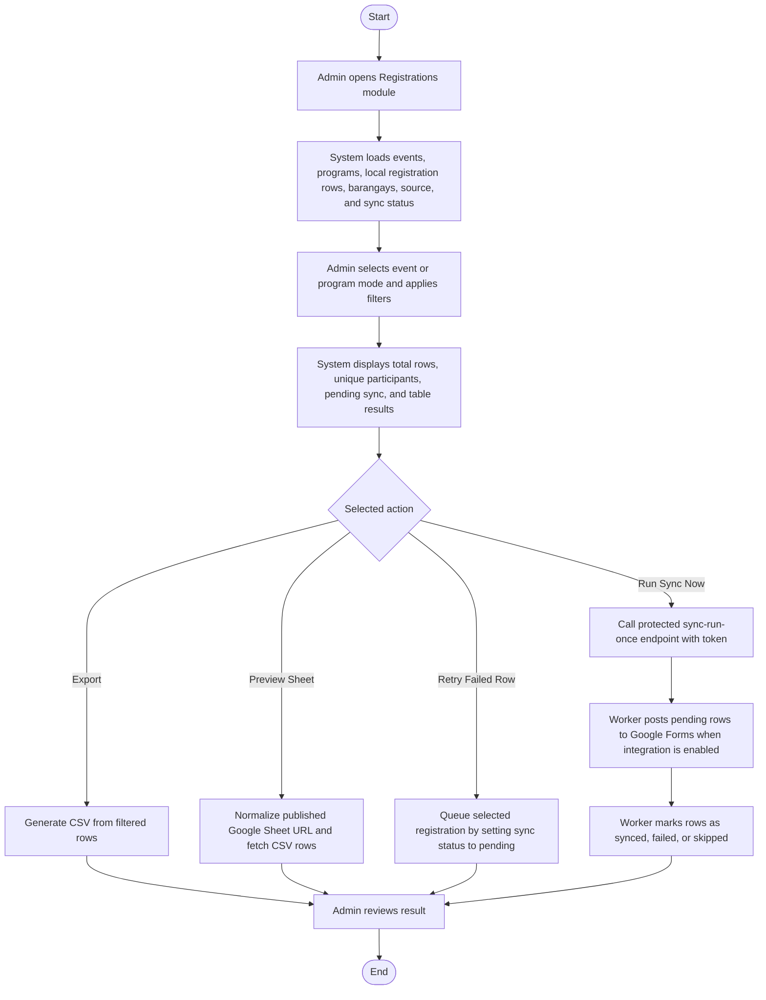
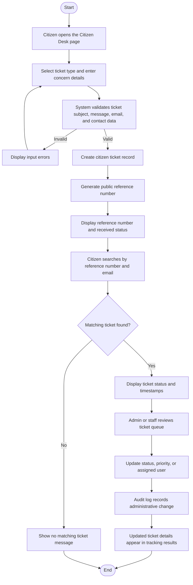
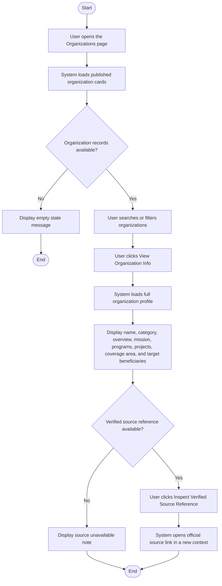

# 3.2.1 Activity Diagram

Activity diagrams show how the major LYDO Connect workflows proceed from one action to the next. The diagrams below focus on the implemented workflows for policy agreement, portal-local registration, external registration sync support, citizen services, transparency publication, compliance records, organization source verification, and audit-supported administration.

## Figure 6.1. Activity Diagram of Policy Agreement Gate

## Figure 6.2. Activity Diagram of Program or Event Registration

## Figure 6.3. Activity Diagram of Registration Monitoring and External Sync

## Figure 6.4. Activity Diagram of Citizen Desk Submission and Tracking

## Figure 6.5. Activity Diagram of Transparency and Governance Publication

## Figure 6.6. Activity Diagram of View Organization Info and Source Verification

## Interpretation

- The policy workflow requires non-admin authenticated users to accept the active Terms of Service and Privacy Policy before protected user tasks continue.
- The registration workflow stores participation directly in `event_registrations` or `program_registrations`, with program registrations also maintaining `user_program_memberships` and sync status fields for external Google Forms processing.
- The registration monitoring workflow lets admins filter local rows, export CSV files, preview published Google Sheets, retry failed rows, and run the sync worker through the protected endpoint.
- The citizen desk workflow supports public tracking through `citizen_tickets` and administrative handling through assigned users, status updates, and audit logs.
- The transparency workflow shows how administrative records become public-facing governance information through disclosure, financial, compliance, and advisory modules.
- The organization information workflow is read-centric: users view organization details and inspect verified source references, without joining or membership state changes.
