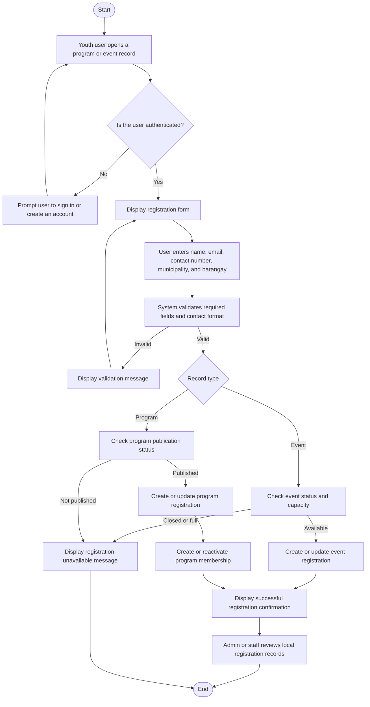
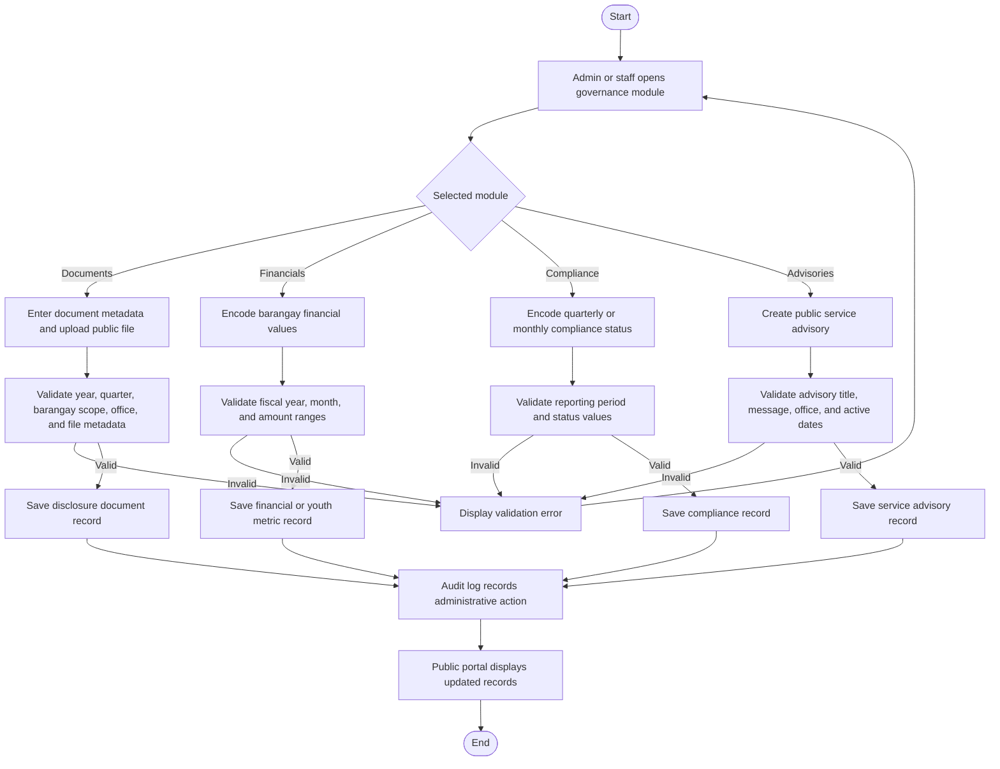

# 3.2.1 Activity Diagram

Activity diagrams show how the major LYDO Connect workflows proceed from one action to the next. The diagrams below focus on the implemented portal-local workflows for registration, citizen services, transparency publication, compliance records, and audit-supported administration.

## Figure 6.1. Activity Diagram of Program or Event Registration

## Figure 6.2. Activity Diagram of Citizen Desk Submission and Tracking

## Figure 6.3. Activity Diagram of Transparency and Governance Publication

## Interpretation

- The registration workflow stores participation directly in `event_registrations` or `program_registrations`, with program registrations also maintaining `user_program_memberships`.
- The citizen desk workflow supports public tracking through `citizen_tickets` and administrative handling through assigned users, status updates, and audit logs.
- The transparency workflow shows how administrative records become public-facing governance information through disclosure, financial, compliance, and advisory modules.
