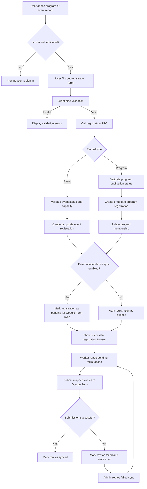
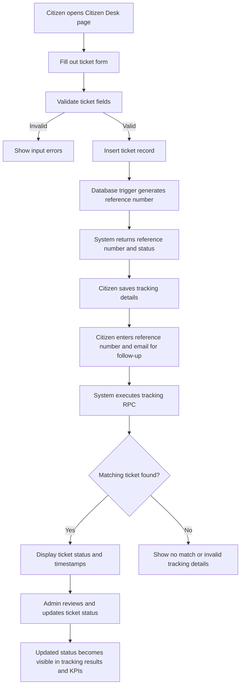
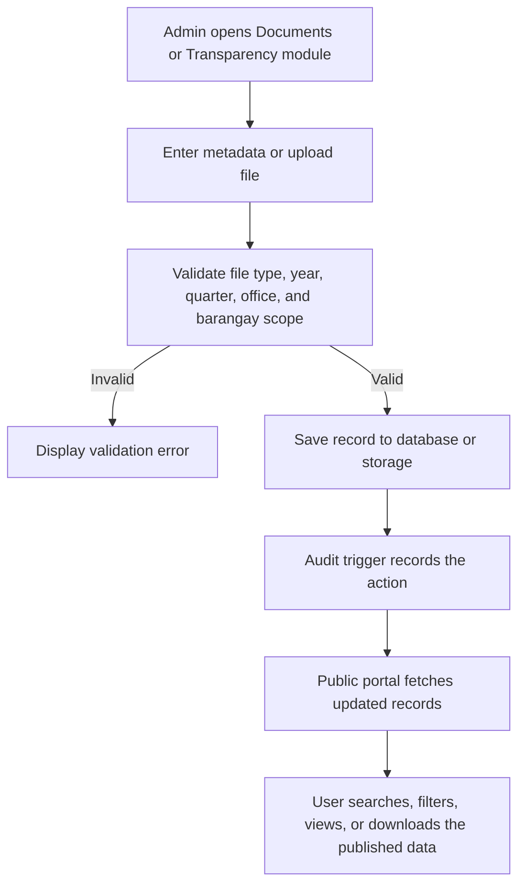

# 3.2.1 Activity Diagram

Activity diagrams show how major workflows proceed from one action to the next. Since LYDO Connect supports several integrated services, the methodology should present the most critical operational flows instead of copying unrelated buying and selling processes from the template.

## A. Program or Event Registration and Sync Workflow

## B. Citizen Desk Submission and Tracking Workflow

## C. Transparency Publication Workflow

## Interpretation

- The first activity diagram captures the system's most distinctive workflow because it joins portal registration, membership maintenance, and optional Google Form synchronization.
- The second diagram reflects the citizen service workflow that supports accountability and public responsiveness.
- The third diagram shows how administrative encoding becomes publicly accessible transparency information.
