# 3.2.2 Class Diagram

The class diagram presents the main logical objects of LYDO Connect and the relationships among them. The classes are aligned with the implemented Supabase entities and avoid unsupported services or optional objects outside the documented scope.

## Figure 7. Class Diagram of LYDO Connect

```mermaid
classDiagram
    class AuthUser {
        +uuid id
        +citext email
    }

    class UserProfile {
        +uuid user_id
        +citext email
        +string full_name
        +string display_name
        +string contact_number
        +string municipality
        +uuid barangay_id
    }

    class Role {
        +smallint id
        +app_role_code code
        +string label
        +string description
    }

    class UserRole {
        +uuid user_id
        +smallint role_id
        +datetime assigned_at
        +uuid assigned_by
    }

    class AdminAccount {
        +uuid id
        +citext username
        +string password_hash
        +string display_name
        +boolean is_active
        +uuid auth_user_id
    }

    class Barangay {
        +uuid id
        +string name
        +decimal latitude
        +decimal longitude
        +string sk_chairperson
        +int youth_population
    }

    class Office {
        +uuid id
        +string name
        +string code
    }

    class Program {
        +uuid id
        +string slug
        +string title
        +string sector
        +date start_date
        +date end_date
        +time start_time
        +time end_time
        +program_status status
        +uuid barangay_id
    }

    class Event {
        +uuid id
        +string slug
        +string title
        +string sector
        +date event_date
        +time start_time
        +time end_time
        +event_status status
        +int capacity
        +uuid barangay_id
    }

    class Organization {
        +uuid id
        +string slug
        +string name
        +string organization_type
        +string overview
        +string mission
        +string programs_activities
        +string coverage_area
        +string target_beneficiaries
        +string contact_info
        +string source_reference_url
        +string related_initiatives
        +int activity_year
        +string credibility_notes
        +organization_status status
        +uuid barangay_id
    }

    class EventRegistration {
        +uuid id
        +uuid user_id
        +uuid event_id
        +string full_name
        +citext email
        +string contact_number
        +string municipality
        +uuid barangay_id
        +registration_status registration_status
        +datetime registered_at
        +datetime cancelled_at
    }

    class ProgramRegistration {
        +uuid id
        +uuid user_id
        +uuid program_id
        +string full_name
        +citext email
        +string contact_number
        +string municipality
        +uuid barangay_id
        +registration_status registration_status
        +datetime registered_at
        +datetime cancelled_at
    }

    class UserProgramMembership {
        +uuid id
        +uuid user_id
        +uuid program_id
        +datetime joined_at
        +datetime left_at
    }

    class DisclosureDocument {
        +uuid id
        +string doc_code
        +string title
        +disclosure_doc_type document_type
        +int fiscal_year
        +quarter_code quarter
        +uuid barangay_id
        +uuid office_id
        +date published_date
        +uuid created_by
    }

    class DocumentDownload {
        +uuid id
        +uuid document_id
        +uuid user_id
        +string ip_hash
        +datetime downloaded_at
    }

    class BarangayFinancial {
        +uuid id
        +uuid barangay_id
        +int fiscal_year
        +smallint month_no
        +decimal allocated_amount
        +decimal utilized_amount
        +decimal sk_budget
        +uuid updated_by
    }

    class BarangayYouthMetric {
        +uuid id
        +uuid barangay_id
        +int fiscal_year
        +int activities
        +int participants
        +int organizations
        +barangay_compliance_status compliance_status
        +uuid updated_by
    }

    class ComplianceBoardStatus {
        +uuid id
        +uuid barangay_id
        +int fiscal_year
        +quarter_code quarter
        +doc_state cbydp
        +doc_state abyip
        +doc_state annual_budget
        +doc_state rcb
        +doc_state mil
        +uuid updated_by
    }

    class MonthlyCompliance {
        +uuid id
        +uuid barangay_id
        +int fiscal_year
        +smallint month_no
        +date due_date
        +smallint completion_percent
        +uuid report_document_id
        +uuid updated_by
    }

    class TicketType {
        +smallint id
        +string name
    }

    class CitizenTicket {
        +uuid id
        +string reference_no
        +smallint type_id
        +string subject
        +string message
        +uuid updated_by
        +citext requester_email
        +ticket_status status
        +smallint priority
    }

    class ServiceAdvisory {
        +uuid id
        +uuid office_id
        +string title
        +service_status status
        +string message
    }

    class AuditLog {
        +uuid id
        +datetime occurred_at
        +uuid actor_user_id
        +string operation
        +string table_schema
        +string table_name
        +json row_pk
        +json old_data
        +json new_data
    }

    AuthUser "1" --> "0..1" UserProfile : owns
    AuthUser "1" --> "0..*" UserRole : assigned
    Role "1" --> "0..*" UserRole : defines
    AuthUser "0..1" --> "0..1" AdminAccount : links

    Barangay "1" --> "0..*" UserProfile : locates
    Barangay "1" --> "0..*" Program : hosts
    Barangay "1" --> "0..*" Event : hosts
    Barangay "1" --> "0..*" Organization : scopes
    Barangay "1" --> "0..*" EventRegistration : records_residence
    Barangay "1" --> "0..*" ProgramRegistration : records_residence
    Barangay "1" --> "0..*" DisclosureDocument : applies_to
    Barangay "1" --> "0..*" BarangayFinancial : records
    Barangay "1" --> "0..*" BarangayYouthMetric : summarizes
    Barangay "1" --> "0..*" ComplianceBoardStatus : monitors
    Barangay "1" --> "0..*" MonthlyCompliance : tracks

    AuthUser "1" --> "0..*" Program : creates
    AuthUser "1" --> "0..*" Event : creates
    AuthUser "1" --> "0..*" Organization : creates
    AuthUser "1" --> "0..*" EventRegistration : registers
    AuthUser "1" --> "0..*" ProgramRegistration : registers
    Event "1" --> "0..*" EventRegistration : receives
    Program "1" --> "0..*" ProgramRegistration : receives
    Program "1" --> "0..*" UserProgramMembership : includes
    AuthUser "1" --> "0..*" UserProgramMembership : owns

    Office "1" --> "0..*" DisclosureDocument : issues
    Office "1" --> "0..*" ServiceAdvisory : posts
    DisclosureDocument "1" --> "0..*" DocumentDownload : downloaded_as
    DisclosureDocument "1" --> "0..*" MonthlyCompliance : supports
    AuthUser "1" --> "0..*" DisclosureDocument : creates
    AuthUser "1" --> "0..*" BarangayFinancial : updates
    AuthUser "1" --> "0..*" BarangayYouthMetric : updates
    AuthUser "1" --> "0..*" ComplianceBoardStatus : updates
    AuthUser "1" --> "0..*" MonthlyCompliance : updates
    AuthUser "1" --> "0..*" ServiceAdvisory : updates
    AuthUser "1" --> "0..*" DocumentDownload : downloads

    TicketType "1" --> "0..*" CitizenTicket : classifies
    AuthUser "1" --> "0..*" CitizenTicket : creates_or_handles
    AuthUser "1" --> "0..*" AuditLog : performs
```

## Interpretation

- `AuthUser`, `UserProfile`, `Role`, `UserRole`, and `AdminAccount` represent identity, profile, and access control records.
- `Program`, `Event`, `Organization`, and registration classes represent youth engagement, participation tracking, and public organization information viewing with verified references.
- `DisclosureDocument`, `DocumentDownload`, barangay financial, youth metric, and compliance classes represent transparency and governance reporting.
- `CitizenTicket`, `TicketType`, `ServiceAdvisory`, and `AuditLog` support citizen services and accountability.
