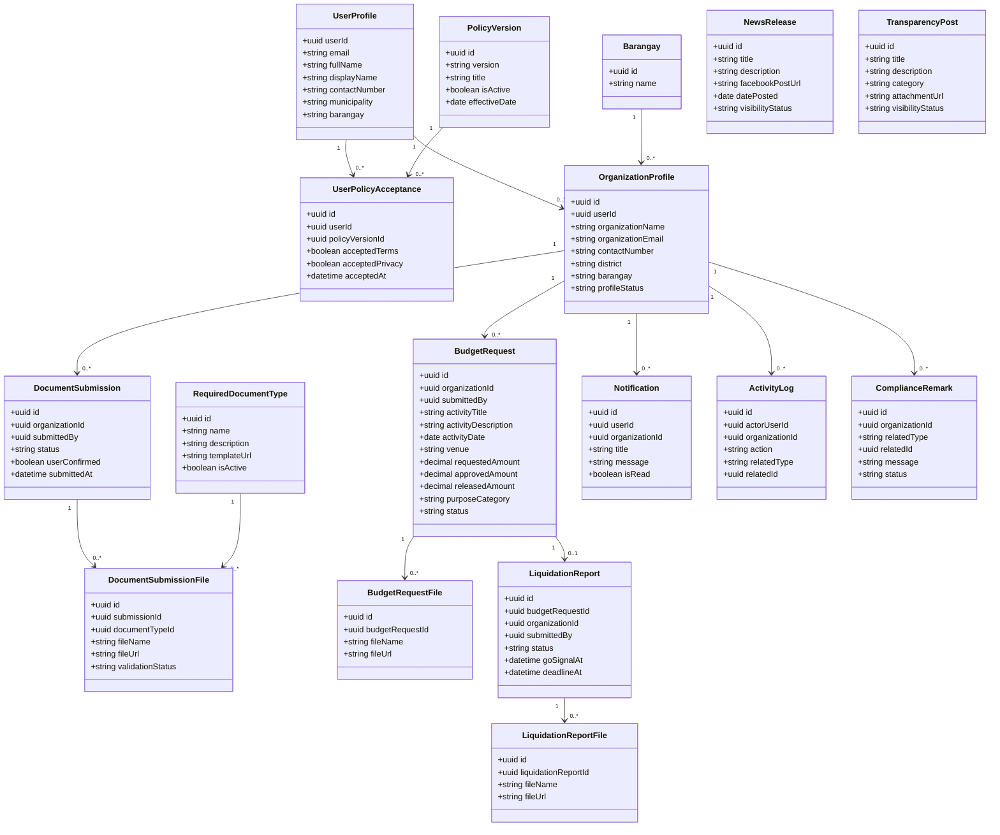

# 3.2.2 Class Diagram

The class diagram presents the current logical objects used by LYDO Connect.

## Figure 7. Class Diagram of LYDO Connect

## Interpretation

- `UserProfile`, `PolicyVersion`, and `UserPolicyAcceptance` support the authentication and policy gate workflow.
- `OrganizationProfile`, `DocumentSubmission`, `BudgetRequest`, and `LiquidationReport` represent the main organization workflow.
- `Barangay` supports the geographic grouping used for budget allocation monitoring.
- `RequiredDocumentType`, `NewsRelease`, and `TransparencyPost` represent admin-managed reference data and public content.
- `Notification`, `ActivityLog`, and `ComplianceRemark` support workflow updates and traceability.
