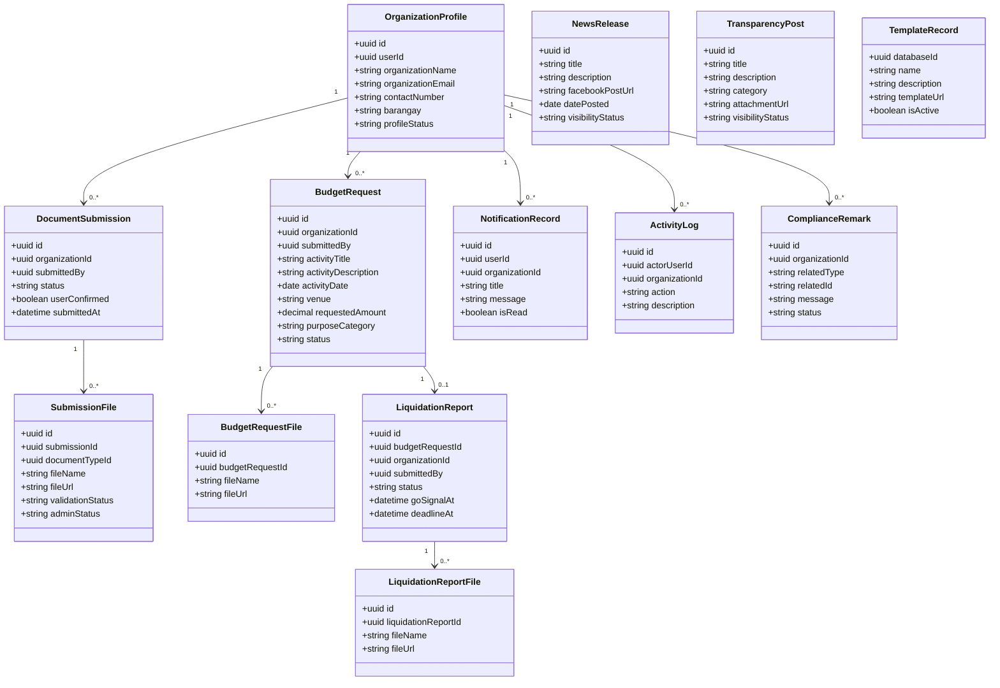

# 3.2.2 Class Diagram

The class diagram presents the current logical objects used by LYDO Connect.

## Figure 7. Class Diagram of LYDO Connect

## Interpretation

- `OrganizationProfile`, `DocumentSubmission`, `BudgetRequest`, and `LiquidationReport` represent the main organization workflow.
- `NewsRelease`, `TransparencyPost`, and `TemplateRecord` represent admin-managed content and reference data.
- `NotificationRecord`, `ActivityLog`, and `ComplianceRemark` support workflow updates and traceability.
