# 3.2.2 Class Diagram

The class diagram presents the main logical objects of the system and the relationships among them. For LYDO Connect, a conceptual class diagram is more appropriate than a code-level class listing because the study is describing the architecture of the proposed system.

```mermaid
classDiagram
    class User {
        +uuid id
        +string email
        +string displayName
        +signIn()
        +signOut()
    }

    class Profile {
        +string fullName
        +string contactNumber
        +string municipality
        +string barangay
        +boolean notifications
        +boolean showEmailPublic
        +updateSettings()
    }

    class Role {
        +smallint id
        +string code
        +string label
    }

    class Barangay {
        +uuid id
        +string name
        +decimal latitude
        +decimal longitude
        +string skChairperson
        +int youthPopulation
    }

    class Program {
        +uuid id
        +string title
        +string sector
        +date startDate
        +date endDate
        +string status
        +publish()
    }

    class Event {
        +uuid id
        +string title
        +string sector
        +date eventDate
        +time startTime
        +time endTime
        +string status
        +int capacity
        +publish()
    }

    class Organization {
        +uuid id
        +string name
        +string type
        +string focus
        +string status
    }

    class Registration {
        <<abstract>>
        +uuid id
        +string fullName
        +string email
        +string contactNumber
        +string municipality
        +string registrationStatus
        +datetime registeredAt
        +cancel()
    }

    class EventRegistration {
        +string source
        +string gformSyncStatus
        +datetime gformSyncedAt
    }

    class ProgramRegistration {
        +string source
        +string gformSyncStatus
        +datetime gformSyncedAt
    }

    class Membership {
        <<abstract>>
        +uuid id
        +datetime joinedAt
        +datetime leftAt
    }

    class ProgramMembership
    class OrganizationMembership

    class DisclosureDocument {
        +uuid id
        +string title
        +string documentType
        +int fiscalYear
        +string quarter
        +date publishedDate
        +publish()
    }

    class ComplianceBoardStatus {
        +uuid id
        +string quarter
        +string cbydp
        +string abyip
        +string annualBudget
        +string rcb
        +string mil
    }

    class MonthlyCompliance {
        +uuid id
        +int monthNo
        +date dueDate
        +int completionPercent
    }

    class BarangayFinancial {
        +uuid id
        +int fiscalYear
        +int monthNo
        +decimal allocatedAmount
        +decimal utilizedAmount
        +decimal skBudget
    }

    class CitizenTicket {
        +uuid id
        +string referenceNo
        +string subject
        +string message
        +string status
        +int priority
        +track()
    }

    class TicketType {
        +smallint id
        +string name
    }

    class ServiceAdvisory {
        +uuid id
        +string title
        +string status
        +string message
    }

    class AuditLog {
        +uuid id
        +datetime occurredAt
        +string operation
        +string tableName
        +json rowPk
        +json oldData
        +json newData
    }

    class RegistrationSyncService {
        +queueRegistration()
        +submitToGoogleForm()
        +retryFailedSync()
    }

    class TransparencyService {
        +publishDocument()
        +loadKpis()
        +loadBoardStatus()
    }

    class CitizenDeskService {
        +submitTicket()
        +trackTicket()
        +updateStatus()
    }

    User "1" --> "1" Profile : has
    User "1" --> "*" Role : assigned
    User "1" --> "*" EventRegistration : creates
    User "1" --> "*" ProgramRegistration : creates
    User "1" --> "*" ProgramMembership : owns
    User "1" --> "*" OrganizationMembership : owns
    EventRegistration --|> Registration
    ProgramRegistration --|> Registration
    ProgramMembership --|> Membership
    OrganizationMembership --|> Membership
    Barangay "1" --> "*" Program : hosts
    Barangay "1" --> "*" Event : hosts
    Barangay "1" --> "*" Organization : scopes
    Barangay "1" --> "*" BarangayFinancial : records
    Barangay "1" --> "*" ComplianceBoardStatus : monitors
    Barangay "1" --> "*" MonthlyCompliance : monitors
    Program "1" --> "*" ProgramRegistration : receives
    Event "1" --> "*" EventRegistration : receives
    Program "1" --> "*" ProgramMembership : includes
    Organization "1" --> "*" OrganizationMembership : includes
    DisclosureDocument "1" --> "*" MonthlyCompliance : supports
    TicketType "1" --> "*" CitizenTicket : classifies
    User "1" --> "*" CitizenTicket : submits
    User "1" --> "*" AuditLog : acts_in
    RegistrationSyncService ..> EventRegistration : processes
    RegistrationSyncService ..> ProgramRegistration : processes
    TransparencyService ..> DisclosureDocument : manages
    TransparencyService ..> ComplianceBoardStatus : manages
    TransparencyService ..> MonthlyCompliance : manages
    TransparencyService ..> BarangayFinancial : summarizes
    CitizenDeskService ..> CitizenTicket : manages
```

## Interpretation

- `User`, `Profile`, and `Role` define identity and access control.
- `Program`, `Event`, `Organization`, and related registration or membership classes represent the youth engagement side of the system.
- `DisclosureDocument`, `ComplianceBoardStatus`, `MonthlyCompliance`, and `BarangayFinancial` represent the transparency and accountability side.
- `CitizenTicket`, `TicketType`, and `ServiceAdvisory` represent public service support.
- `AuditLog` and service classes represent governance controls and system automation.
