# 3.2.4 Database Schema

The database schema describes the major entities, keys, and relationships that support LYDO Connect. This section is appropriate because the system depends on structured, relational storage for user management, youth participation, transparency records, financial data, citizen tickets, and audit logs.

## Entity Relationship Diagram

```mermaid
erDiagram
    AUTH_USERS ||--|| USER_PROFILES : owns
    AUTH_USERS ||--o{ USER_ROLES : assigned
    ROLES ||--o{ USER_ROLES : defines

    BARANGAYS ||--o{ USER_PROFILES : locates
    BARANGAYS ||--o{ PROGRAMS : hosts
    BARANGAYS ||--o{ EVENTS : hosts
    BARANGAYS ||--o{ ORGANIZATIONS : scopes
    BARANGAYS ||--o{ BARANGAY_FINANCIALS : tracks
    BARANGAYS ||--o{ BARANGAY_YOUTH_METRICS : summarizes
    BARANGAYS ||--o{ COMPLIANCE_BOARD_STATUS : monitors
    BARANGAYS ||--o{ MONTHLY_COMPLIANCE : monitors
    BARANGAYS ||--o{ DISCLOSURE_DOCUMENTS : applies_to

    AUTH_USERS ||--o{ PROGRAMS : creates
    AUTH_USERS ||--o{ EVENTS : creates
    AUTH_USERS ||--o{ ORGANIZATIONS : creates

    AUTH_USERS ||--o{ EVENT_REGISTRATIONS : registers
    EVENTS ||--o{ EVENT_REGISTRATIONS : receives

    AUTH_USERS ||--o{ PROGRAM_REGISTRATIONS : registers
    PROGRAMS ||--o{ PROGRAM_REGISTRATIONS : receives

    AUTH_USERS ||--o{ USER_PROGRAM_MEMBERSHIPS : joins
    PROGRAMS ||--o{ USER_PROGRAM_MEMBERSHIPS : includes

    AUTH_USERS ||--o{ USER_ORG_MEMBERSHIPS : joins
    ORGANIZATIONS ||--o{ USER_ORG_MEMBERSHIPS : includes

    OFFICES ||--o{ DISCLOSURE_DOCUMENTS : issues
    DISCLOSURE_DOCUMENTS ||--o{ DOCUMENT_DOWNLOADS : logs
    DISCLOSURE_DOCUMENTS ||--o{ MONTHLY_COMPLIANCE : supports

    TICKET_TYPES ||--o{ CITIZEN_TICKETS : classifies
    AUTH_USERS ||--o{ CITIZEN_TICKETS : files
    OFFICES ||--o{ SERVICE_ADVISORIES : posts

    AUTH_USERS ||--o{ AUDIT_LOGS : generates

    ROLES {
      smallint id PK
      app_role_code code UK
      text label
    }

    USER_PROFILES {
      uuid user_id PK
      citext email UK
      text full_name
      uuid barangay_id FK
    }

    PROGRAMS {
      uuid id PK
      text slug UK
      text title
      program_status status
      uuid barangay_id FK
    }

    EVENTS {
      uuid id PK
      text slug UK
      text title
      event_status status
      uuid barangay_id FK
    }

    ORGANIZATIONS {
      uuid id PK
      text slug UK
      text name
      organization_status status
      uuid barangay_id FK
    }

    EVENT_REGISTRATIONS {
      uuid id PK
      uuid user_id FK
      uuid event_id FK
      registration_status registration_status
      text gform_sync_status
    }

    PROGRAM_REGISTRATIONS {
      uuid id PK
      uuid user_id FK
      uuid program_id FK
      registration_status registration_status
      text gform_sync_status
    }

    DISCLOSURE_DOCUMENTS {
      uuid id PK
      text doc_code UK
      disclosure_doc_type document_type
      int fiscal_year
      quarter_code quarter
      uuid office_id FK
    }

    MONTHLY_COMPLIANCE {
      uuid id PK
      uuid barangay_id FK
      int fiscal_year
      smallint month_no
      uuid report_document_id FK
    }

    CITIZEN_TICKETS {
      uuid id PK
      text reference_no UK
      smallint type_id FK
      ticket_status status
    }

    AUDIT_LOGS {
      uuid id PK
      uuid actor_user_id FK
      text operation
      text table_name
    }
```

## Schema Notes

- The system uses **Supabase Authentication** for account identity and stores related user details in `user_profiles`.
- `programs`, `events`, and `organizations` are independent content tables because each has a different business purpose and management flow.
- `event_registrations` and `program_registrations` are separated because event logic includes capacity checks while program logic includes membership synchronization.
- `disclosure_documents`, `compliance_board_status`, `monthly_compliance`, `barangay_financials`, and `barangay_youth_metrics` support the transparency and governance functions of the study.
- `citizen_tickets` and `ticket_types` support public service requests and structured ticket tracking.
- `audit_logs` records create, update, and delete actions across important administrative tables for accountability.

## Design Rationale

The schema follows a modular structure so that youth engagement, transparency, and citizen service records can coexist in one platform without forcing unrelated data into a single table. This is more suitable for LYDO Connect than the template's marketplace-oriented schema.
