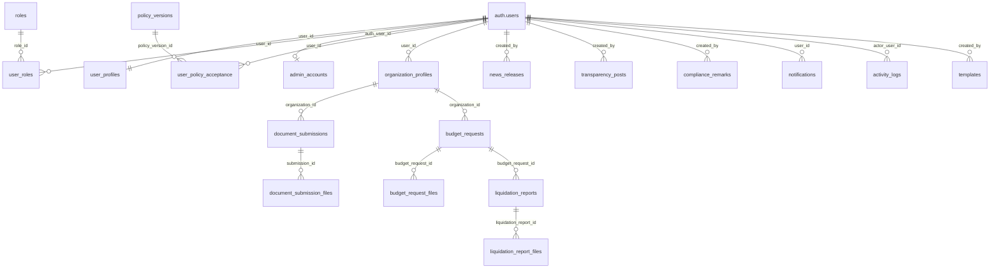

# 3.2.4 Database Schema

The database schema describes the tables that support the current LYDO Connect workflow. The present schema is centered on authentication, policy acceptance, organization profiles, document submission, budget requests, liquidation reporting, news releases, transparency posts, templates, notifications, activity logs, and compliance remarks.

## Overall Database Schema

## Core Tables

- `roles`
- `user_roles`
- `user_profiles`
- `admin_accounts`
- `admin_sessions`
- `policy_versions`
- `user_policy_acceptance`
- `organization_profiles`
- `required_document_types`
- `document_submissions`
- `document_submission_files`
- `budget_requests`
- `budget_request_files`
- `liquidation_reports`
- `liquidation_report_files`
- `news_releases`
- `transparency_posts`
- `compliance_remarks`
- `notifications`
- `activity_logs`

## Summary

The current schema is limited to the tables that support the current app workflow.
