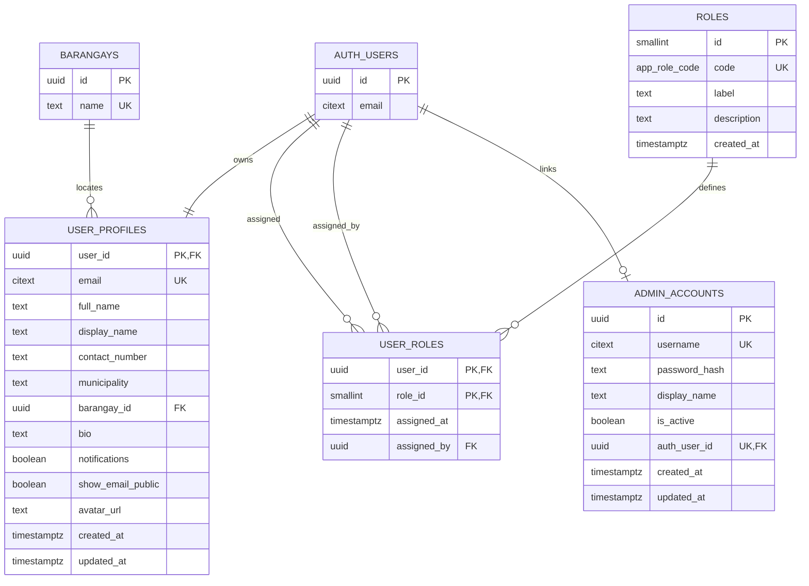
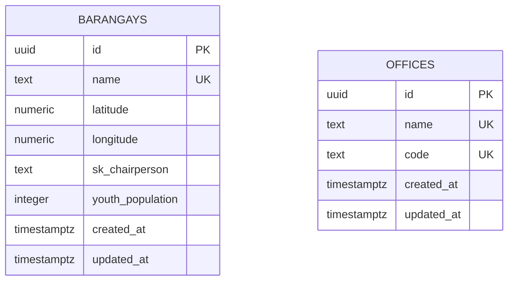
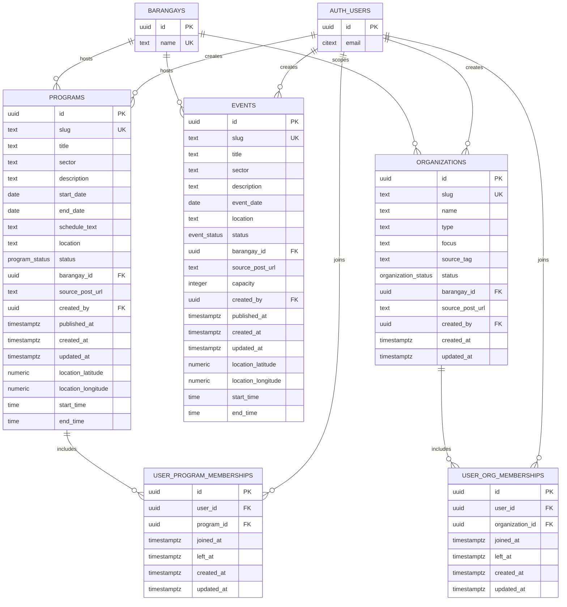
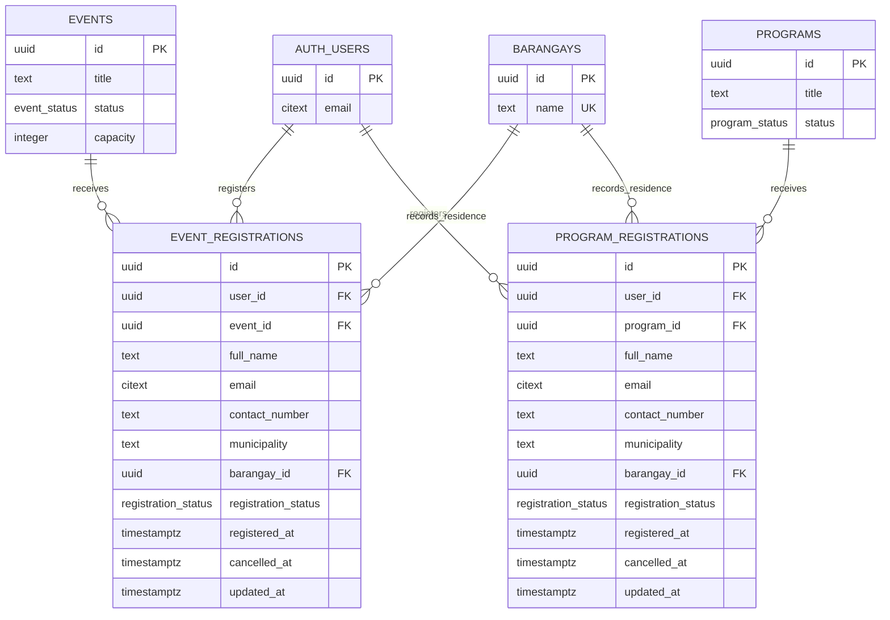
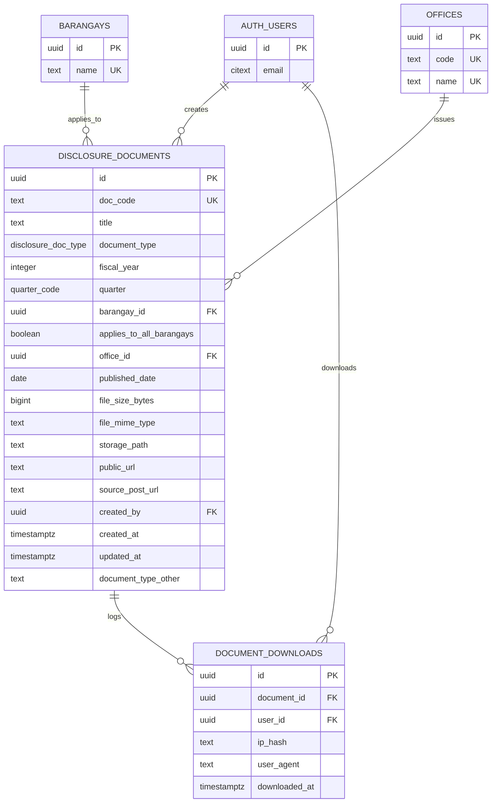
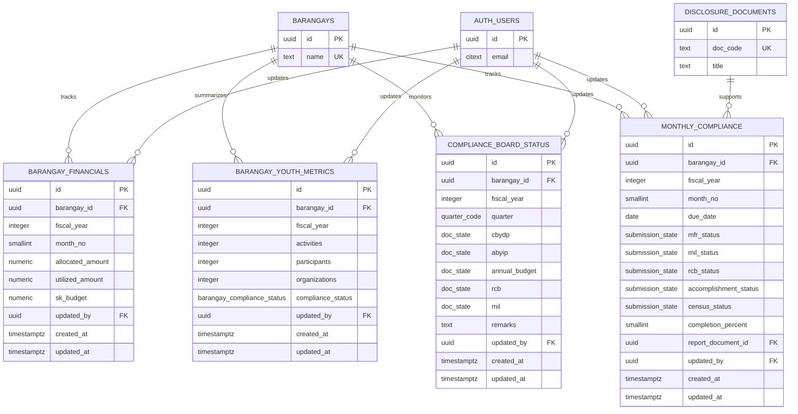
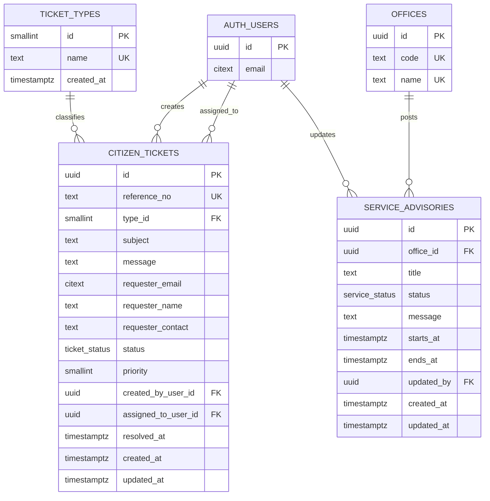
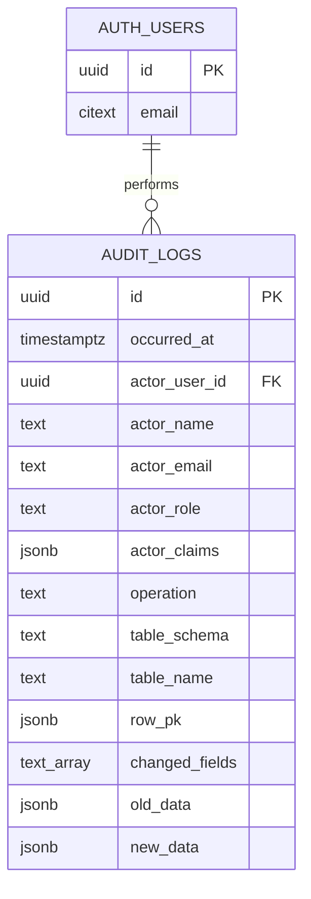

# 3.2.4 Database Schema

The database schema describes the major entities, keys, and relationships that support LYDO Connect. The schema is based on `supabase/schema_supabase_all_in_one.sql`, with the request-specified optional fields omitted from the manuscript documentation. To keep the diagrams readable, the ERD is partitioned into functional modules while repeating simplified reference tables where needed.

## Figure 17.1. Entity Relationship Diagram of Authentication, Users, and Roles

## Figure 17.2. Entity Relationship Diagram of Barangay and Office Reference Data

## Figure 17.3. Entity Relationship Diagram of Youth Programs, Events, and Organizations

## Figure 17.4. Entity Relationship Diagram of Registrations

## Figure 17.5. Entity Relationship Diagram of Transparency and Public Documents

## Figure 17.6. Entity Relationship Diagram of Barangay Financials and Compliance

## Figure 17.7. Entity Relationship Diagram of Citizen Services and Advisories

## Figure 17.8. Entity Relationship Diagram of Audit Logs

## Schema Notes

- The system uses Supabase Authentication for account identity and stores application profile details in `user_profiles`.
- `programs`, `events`, and `organizations` are separate entities because each supports a different youth engagement workflow.
- `event_registrations` and `program_registrations` are separate transaction tables. Program registration also supports membership maintenance through `user_program_memberships`.
- `disclosure_documents`, financial tables, youth metrics, compliance records, and service advisories support public transparency and governance monitoring.
- `citizen_tickets` and `ticket_types` support public service requests and structured ticket tracking.
- `audit_logs` records administrative create, update, and delete activity for accountability.

## Important Constraints

- Unique identifiers and labels are enforced for role codes, barangay names, office names and codes, program slugs, event slugs, organization slugs, disclosure document codes, citizen ticket reference numbers, and admin usernames.
- Active membership and registration duplication is controlled by unique indexes on user-program memberships, user-organization memberships, event registrations, and program registrations.
- Date and time rules prevent invalid program date ranges and invalid start/end time ranges for programs and events.
- Numeric checks prevent negative youth population, negative financial amounts, invalid fiscal years, invalid month numbers, invalid completion percentages, and invalid event capacity values.
- Compliance and workflow fields use enumerated data types to keep statuses consistent across the application.

## Design Rationale

The schema follows a modular relational design so youth engagement, transparency, financial reporting, citizen services, and audit records can coexist without forcing unrelated information into a single table. The partitioned ERD format preserves the relationships while keeping each module readable.
