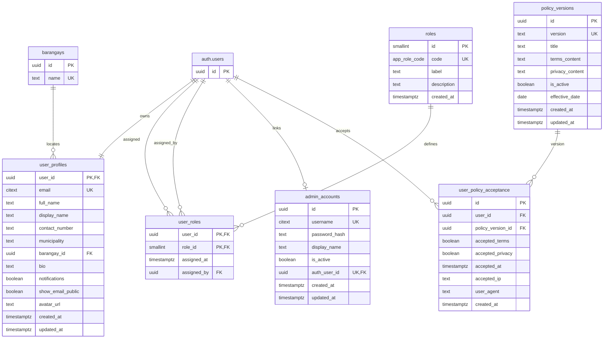
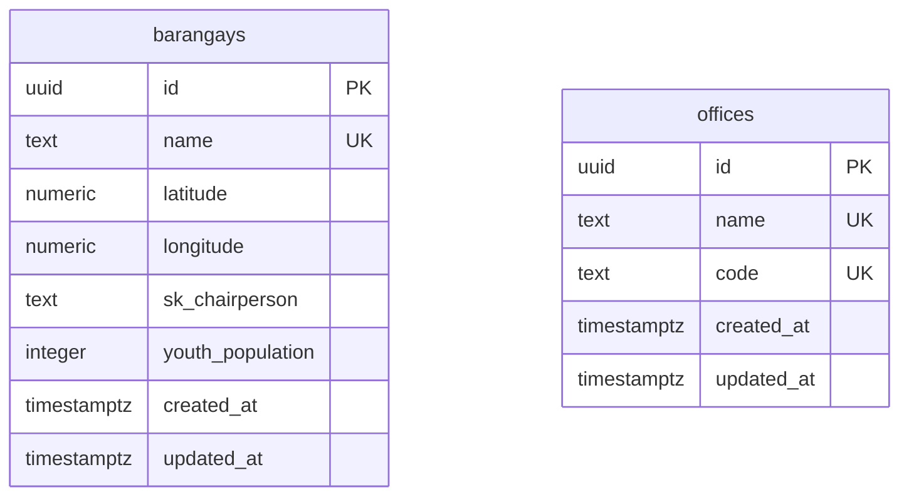
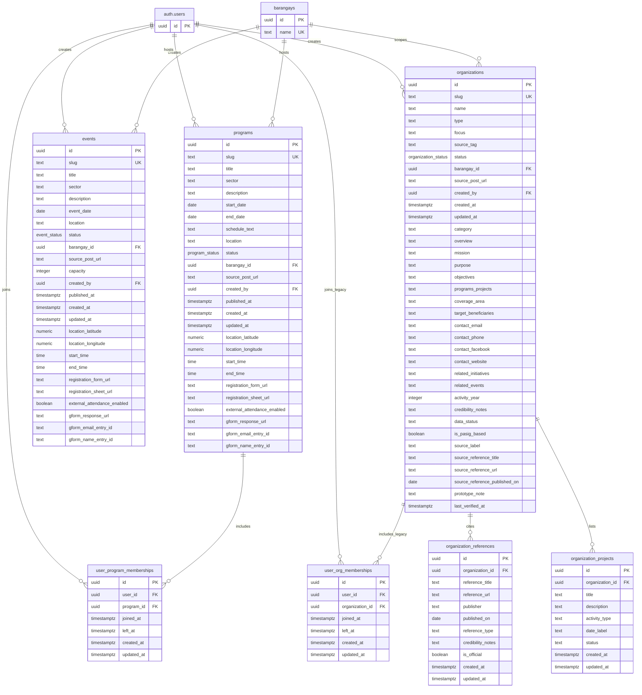
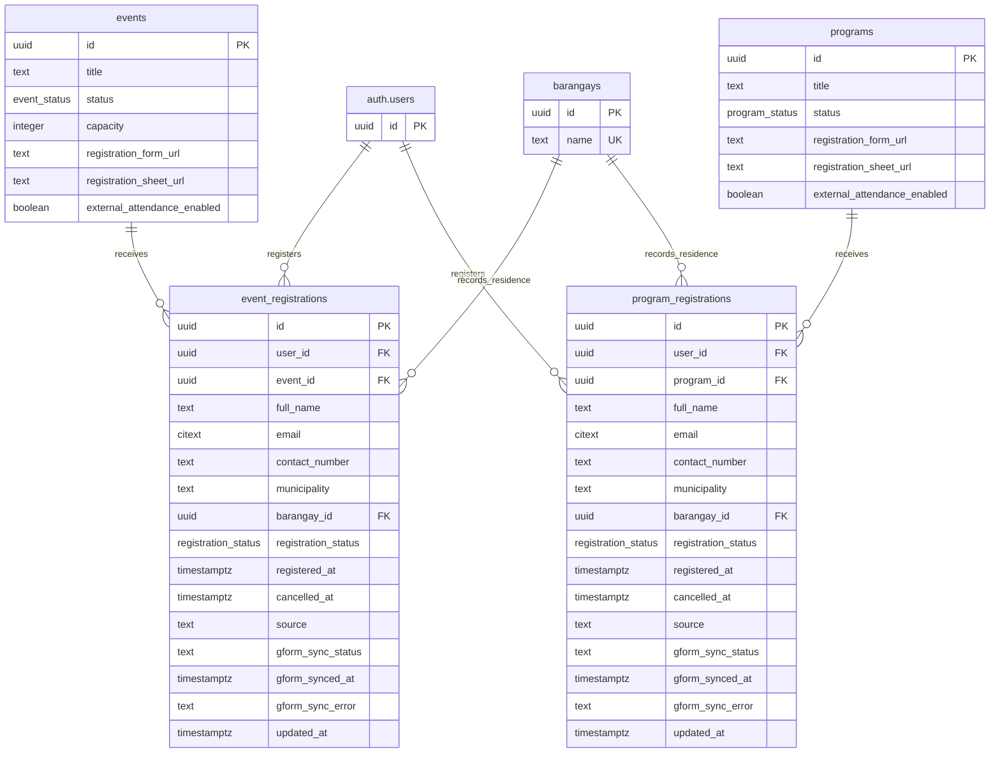
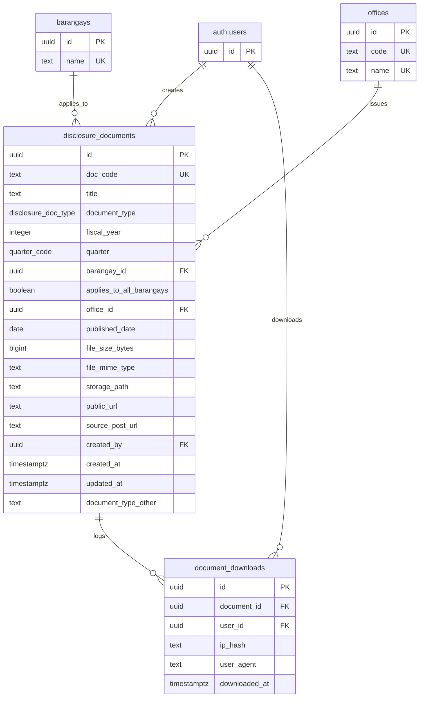
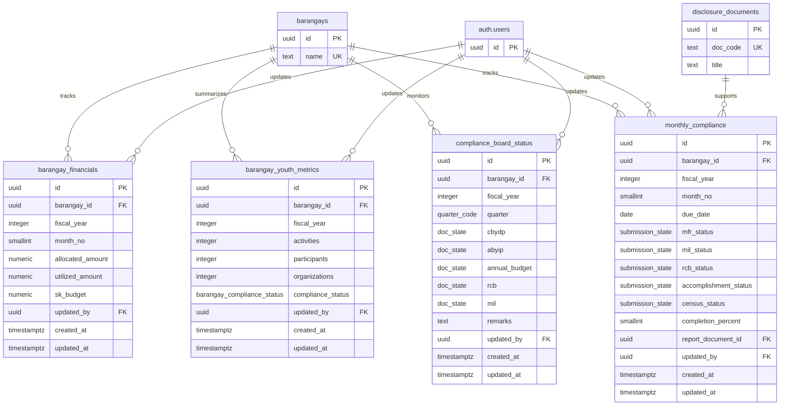
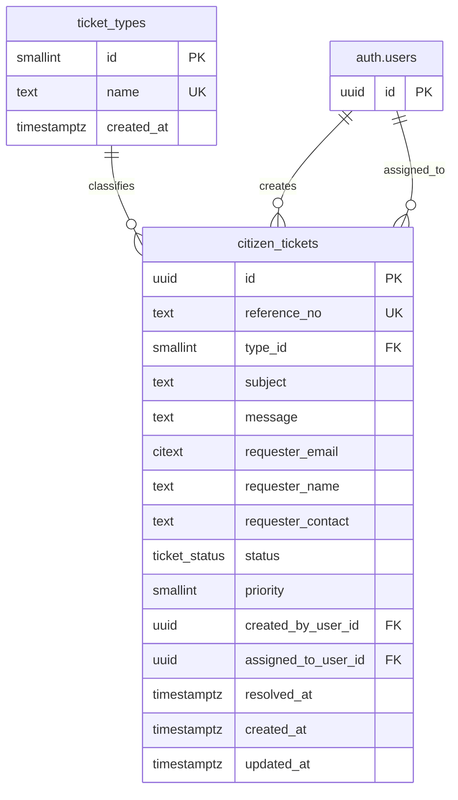
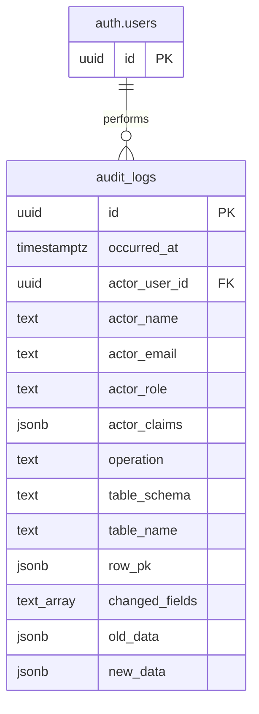

# 3.2.4 Database Schema

The database schema describes the major entities, keys, and relationships that support LYDO Connect. The schema is based on the current Supabase SQL migrations and the consolidated `supabase/schema_supabase_all_in_one.sql` file. This section first presents one complete ERD for the whole database, followed by partitioned diagrams that show each module in a more readable form.

## Overall Database Schema

The overall database schema shows the complete documented database structure in one unified view. To make the full ERD easier to follow, the diagram is grouped by related modules, places shared reference tables near the top, and uses foreign key column names as relationship labels. Metadata-style user foreign keys, such as creator and updater fields, are marked inside the table boxes while the visible relationship lines focus on the structural database relationships. The succeeding partitioned diagrams repeat the same schema by module so each part can be reviewed more easily.

## Figure 17. Overall Entity Relationship Diagram

```mermaid
erDiagram
    direction TB

    %% Authentication and user management
    auth.users ||--|| user_profiles : user_id
    auth.users ||--o{ user_roles : user_id
    auth.users ||--o{ user_roles : assigned_by
    roles ||--o{ user_roles : role_id
    auth.users ||--o| admin_accounts : auth_user_id
    barangays ||--o{ user_profiles : barangay_id
    auth.users ||--o{ user_policy_acceptance : user_id
    policy_versions ||--o{ user_policy_acceptance : policy_version_id

    %% Programs, events, and organizations
    barangays ||--o{ programs : barangay_id
    barangays ||--o{ events : barangay_id
    barangays ||--o{ organizations : barangay_id
    organizations ||--o{ organization_references : organization_id
    organizations ||--o{ organization_projects : organization_id
    auth.users ||--o{ user_program_memberships : user_id
    programs ||--o{ user_program_memberships : program_id
    auth.users ||--o{ user_org_memberships : user_id_legacy
    organizations ||--o{ user_org_memberships : organization_id_legacy

    %% Registrations
    auth.users ||--o{ event_registrations : user_id
    events ||--o{ event_registrations : event_id
    barangays ||--o{ event_registrations : barangay_id
    auth.users ||--o{ program_registrations : user_id
    programs ||--o{ program_registrations : program_id
    barangays ||--o{ program_registrations : barangay_id

    %% Transparency and public documents
    barangays ||--o{ disclosure_documents : barangay_id
    offices ||--o{ disclosure_documents : office_id
    disclosure_documents ||--o{ document_downloads : document_id
    auth.users ||--o{ document_downloads : user_id

    %% Barangay financials and compliance
    barangays ||--o{ barangay_financials : barangay_id
    barangays ||--o{ barangay_youth_metrics : barangay_id
    barangays ||--o{ compliance_board_status : barangay_id
    barangays ||--o{ monthly_compliance : barangay_id
    disclosure_documents ||--o{ monthly_compliance : report_document_id

    %% Citizen services and audit logs
    ticket_types ||--o{ citizen_tickets : type_id
    auth.users ||--o{ citizen_tickets : created_by_user_id
    auth.users ||--o{ citizen_tickets : assigned_to_user_id
    auth.users ||--o{ audit_logs : actor_user_id

    auth.users {
      uuid id PK
    }

    roles {
      smallint id PK
      app_role_code code UK
      text label
      text description
      timestamptz created_at
    }

    user_roles {
      uuid user_id PK, FK
      smallint role_id PK, FK
      timestamptz assigned_at
      uuid assigned_by FK
    }

    user_profiles {
      uuid user_id PK, FK
      citext email UK
      text full_name
      text display_name
      text contact_number
      text municipality
      uuid barangay_id FK
      boolean notifications
      boolean show_email_public
    }

    policy_versions {
      uuid id PK
      text version UK
      text title
      text terms_content
      text privacy_content
      boolean is_active
      date effective_date
    }

    user_policy_acceptance {
      uuid id PK
      uuid user_id FK
      uuid policy_version_id FK
      boolean accepted_terms
      boolean accepted_privacy
      timestamptz accepted_at
    }

    admin_accounts {
      uuid id PK
      citext username UK
      text password_hash
      text display_name
      boolean is_active
      uuid auth_user_id UK, FK
    }

    barangays {
      uuid id PK
      text name UK
      numeric latitude
      numeric longitude
      text sk_chairperson
      integer youth_population
    }

    offices {
      uuid id PK
      text name UK
      text code UK
    }

    programs {
      uuid id PK
      text slug UK
      text title
      text sector
      date start_date
      date end_date
      text location
      program_status status
      uuid barangay_id FK
      uuid created_by FK
      numeric location_latitude
      numeric location_longitude
      time start_time
      time end_time
      text registration_form_url
      text registration_sheet_url
      boolean external_attendance_enabled
      text gform_response_url
    }

    events {
      uuid id PK
      text slug UK
      text title
      text sector
      date event_date
      text location
      event_status status
      uuid barangay_id FK
      uuid created_by FK
      integer capacity
      numeric location_latitude
      numeric location_longitude
      time start_time
      time end_time
      text registration_form_url
      text registration_sheet_url
      boolean external_attendance_enabled
      text gform_response_url
    }

    organizations {
      uuid id PK
      text slug UK
      text name
      text type
      text focus
      text source_tag
      organization_status status
      uuid barangay_id FK
      text source_post_url
      uuid created_by FK
      timestamptz created_at
      timestamptz updated_at
      text category
      text overview
      text mission
      text purpose
      text objectives
      text programs_projects
      text coverage_area
      text target_beneficiaries
      text contact_email
      text contact_phone
      text contact_facebook
      text contact_website
      text related_initiatives
      text related_events
      integer activity_year
      text data_status
      boolean is_pasig_based
      text source_label
      text source_reference_title
      text source_reference_url
      date source_reference_published_on
      text prototype_note
      text credibility_notes
      timestamptz last_verified_at
    }

    organization_references {
      uuid id PK
      uuid organization_id FK
      text reference_title
      text reference_url
      text publisher
      date published_on
      text reference_type
      boolean is_official
    }

    organization_projects {
      uuid id PK
      uuid organization_id FK
      text title
      text description
      text activity_type
      text date_label
      text status
    }

    user_program_memberships {
      uuid id PK
      uuid user_id FK
      uuid program_id FK
      timestamptz joined_at
      timestamptz left_at
    }

    user_org_memberships {
      uuid id PK
      uuid user_id FK
      uuid organization_id FK
      timestamptz joined_at
      timestamptz left_at
    }

    event_registrations {
      uuid id PK
      uuid user_id FK
      uuid event_id FK
      text full_name
      citext email
      text contact_number
      text municipality
      uuid barangay_id FK
      registration_status registration_status
      timestamptz registered_at
      timestamptz cancelled_at
      text source
      text gform_sync_status
      timestamptz gform_synced_at
    }

    program_registrations {
      uuid id PK
      uuid user_id FK
      uuid program_id FK
      text full_name
      citext email
      text contact_number
      text municipality
      uuid barangay_id FK
      registration_status registration_status
      timestamptz registered_at
      timestamptz cancelled_at
      text source
      text gform_sync_status
      timestamptz gform_synced_at
    }

    disclosure_documents {
      uuid id PK
      text doc_code UK
      text title
      disclosure_doc_type document_type
      integer fiscal_year
      quarter_code quarter
      uuid barangay_id FK
      uuid office_id FK
      uuid created_by FK
      text document_type_other
    }

    document_downloads {
      uuid id PK
      uuid document_id FK
      uuid user_id FK
      timestamptz downloaded_at
    }

    barangay_financials {
      uuid id PK
      uuid barangay_id FK
      integer fiscal_year
      smallint month_no
      numeric allocated_amount
      numeric utilized_amount
      numeric sk_budget
      uuid updated_by FK
    }

    barangay_youth_metrics {
      uuid id PK
      uuid barangay_id FK
      integer fiscal_year
      integer activities
      integer participants
      integer organizations
      barangay_compliance_status compliance_status
      uuid updated_by FK
    }

    compliance_board_status {
      uuid id PK
      uuid barangay_id FK
      integer fiscal_year
      quarter_code quarter
      doc_state cbydp
      doc_state abyip
      doc_state annual_budget
      doc_state rcb
      doc_state mil
      uuid updated_by FK
    }

    monthly_compliance {
      uuid id PK
      uuid barangay_id FK
      integer fiscal_year
      smallint month_no
      date due_date
      submission_state mfr_status
      submission_state mil_status
      submission_state rcb_status
      submission_state accomplishment_status
      submission_state census_status
      smallint completion_percent
      uuid report_document_id FK
      uuid updated_by FK
    }

    ticket_types {
      smallint id PK
      text name UK
      timestamptz created_at
    }

    citizen_tickets {
      uuid id PK
      text reference_no UK
      smallint type_id FK
      text subject
      citext requester_email
      uuid created_by_user_id FK
      uuid assigned_to_user_id FK
      ticket_status status
      smallint priority
    }

    audit_logs {
      uuid id PK
      uuid actor_user_id FK
      text operation
      text table_schema
      text table_name
    }
```

## Figure 17.1. Entity Relationship Diagram of Authentication, Users, and Roles

## Figure 17.2. Entity Relationship Diagram of Barangay and Office Reference Data

## Figure 17.3. Entity Relationship Diagram of Youth Programs, Events, and Organizations

## Figure 17.4. Entity Relationship Diagram of Registrations

## Figure 17.5. Entity Relationship Diagram of Transparency and Public Documents

## Figure 17.6. Entity Relationship Diagram of Barangay Financials and Compliance

## Figure 17.7. Entity Relationship Diagram of Citizen Services

## Figure 17.8. Entity Relationship Diagram of Audit Logs

## Schema Notes

- The system uses Supabase Authentication for account identity and stores application profile details in `user_profiles`.
- `policy_versions` and `user_policy_acceptance` support the active Terms of Service and Privacy Policy gate for authenticated non-admin users.
- `programs`, `events`, and `organizations` are separate entities because each supports a different youth engagement workflow. The organization module is now centered on public viewing of verified Pasig organization details.
- `programs` and `events` include precise location, time, registration form, Google Sheet, and external attendance fields to support current listing and registration-monitoring behavior.
- `event_registrations` and `program_registrations` are separate transaction tables. They store local registrations as the source of record and include source and Google Forms sync state fields. Program registration also supports membership maintenance through `user_program_memberships`.
- `organizations`, `organization_references`, and `organization_projects` include source-reference, project, and credibility-oriented fields to support official-source validation and null-safe storage of unavailable public details.
- `user_org_memberships` is retained as a legacy compatibility table and is not part of the primary public organization-information flow.
- `disclosure_documents`, financial tables, youth metrics, and compliance records support public transparency and governance monitoring.
- `citizen_tickets` and `ticket_types` support public service requests and structured ticket tracking.
- `audit_logs` records administrative create, update, and delete activity for accountability.

## Important Constraints

- Unique identifiers and labels are enforced for role codes, barangay names, office names and codes, program slugs, event slugs, organization slugs, disclosure document codes, citizen ticket reference numbers, and admin usernames.
- Active membership and registration duplication is controlled by unique indexes on user-program memberships, user-organization memberships (legacy), event registrations, and program registrations.
- Policy acceptance is unique by user and policy version, while only active policy versions are read by the user-facing agreement gate.
- Organization detail constraints include required core identity fields, optional nullable descriptive fields, source-reference checks, data-status values, and unique organization reference URLs configured in the Supabase organization update scripts.
- Registration integration constraints allow only valid Google Forms and Google Sheets URL patterns for registration settings and restrict sync state values to `pending`, `synced`, `failed`, or `skipped`.
- Date and time rules prevent invalid program date ranges and invalid start/end time ranges for programs and events.
- Numeric checks prevent negative youth population, negative financial amounts, invalid fiscal years, invalid month numbers, invalid completion percentages, and invalid event capacity values.
- Compliance and workflow fields use enumerated data types to keep statuses consistent across the application.

## Design Rationale

The schema follows a modular relational design so youth engagement, transparency, financial reporting, citizen services, and audit records can coexist without forcing unrelated information into a single table. The partitioned ERD format preserves the relationships while keeping each module readable.
