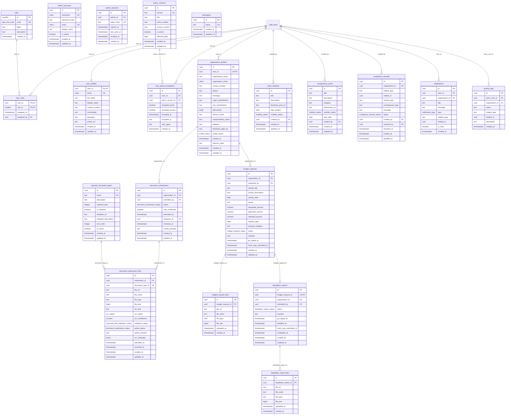
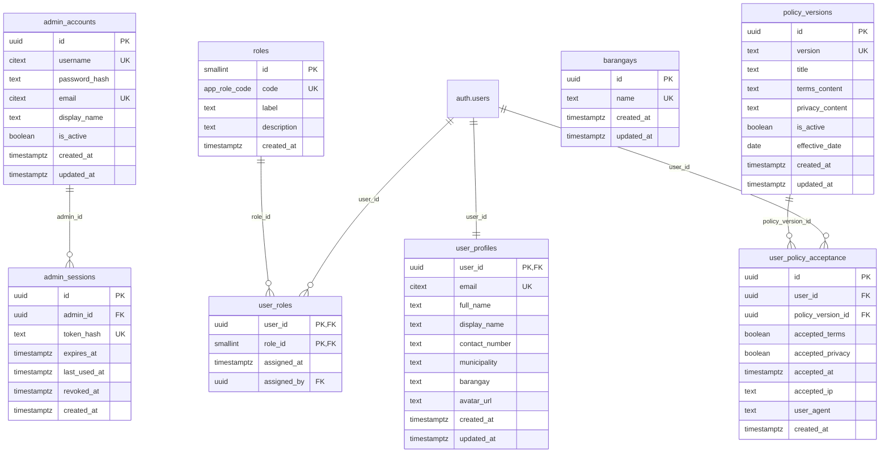
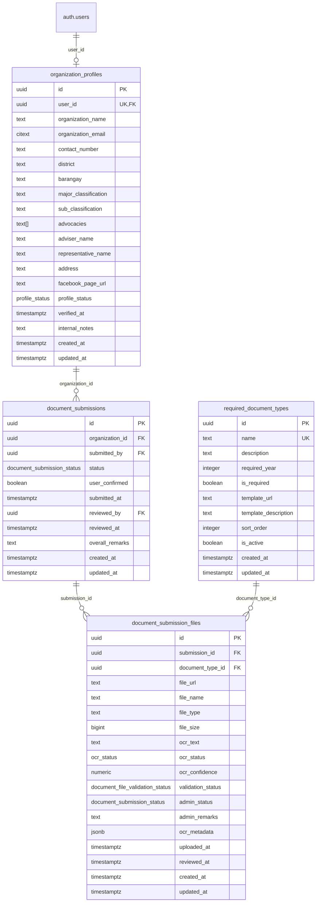
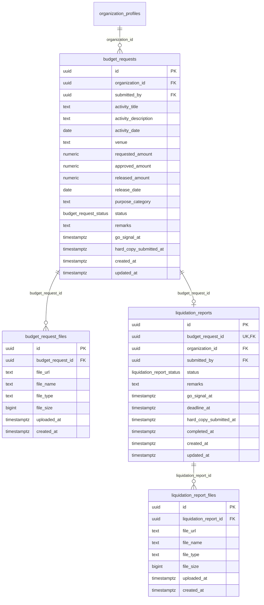
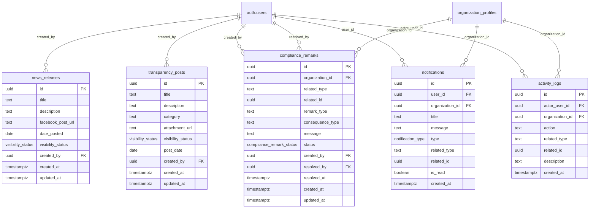

# 3.2.4 Database Schema

The database schema describes the tables that support the current LYDO Connect workflow. To make the chapter easier to read, the ERD is presented in one overall figure and then broken into smaller subpart figures grouped by workflow. The schema is centered on authentication, policy acceptance, user profiles, barangay lookup data, organization profiles, required document types, document submission, budget requests, liquidation reporting, news releases, transparency posts, notifications, activity logs, and compliance remarks. Budget allocation monitoring is derived from the `budget_requests` and `organization_profiles` tables, especially the `released_amount`, `district`, and `barangay` fields.

## Overall Database Schema

## Subpart 1. Authentication, Users, and Roles

This subpart shows the tables that control access, profiles, and policy acceptance.

## Figure 17.2. Entity Relationship Diagram of Authentication, Users, and Roles

## Subpart 2. Organization and Document Workflow

This subpart shows the data flow from organization registration to document review.

## Figure 17.3. Entity Relationship Diagram of Organization and Document Workflow

## Subpart 3. Budget and Liquidation Workflow

This subpart shows the request, release, and liquidation cycle used for budget monitoring.

## Figure 17.4. Entity Relationship Diagram of Budget and Liquidation Workflow

## Subpart 4. Admin Content, Notifications, and Audit Logs

This subpart groups the admin-managed content tables and the system tracking tables.

## Figure 17.5. Entity Relationship Diagram of Admin Content, Notifications, and Audit Logs

## Core Tables

- `roles`
- `user_roles`
- `user_profiles`
- `admin_accounts`
- `admin_sessions`
- `policy_versions`
- `user_policy_acceptance`
- `organization_profiles`
- `required_document_types`
- `document_submissions`
- `document_submission_files`
- `budget_requests`
- `budget_request_files`
- `liquidation_reports`
- `liquidation_report_files`
- `news_releases`
- `transparency_posts`
- `compliance_remarks`
- `notifications`
- `activity_logs`
- `news_releases`
- `transparency_posts`
- `compliance_remarks`

## Key Notes

- `PK` means primary key.
- `FK` means foreign key.
- `UK` means unique key.
- Composite unique constraints are used for `user_policy_acceptance (user_id, policy_version_id)` and `document_submission_files (submission_id, document_type_id)`.
- `budget_requests` to `liquidation_reports` is a one-to-one workflow link because each budget request can have at most one liquidation report.
- The subpart figures are intentionally grouped by workflow so the chapter matches the thesis-style layout in your sample.

## Summary

The current schema is limited to the tables that support the current app workflow. Legacy compatibility tables are intentionally not shown in the subpart figures because they are not part of the current chapter scope.
