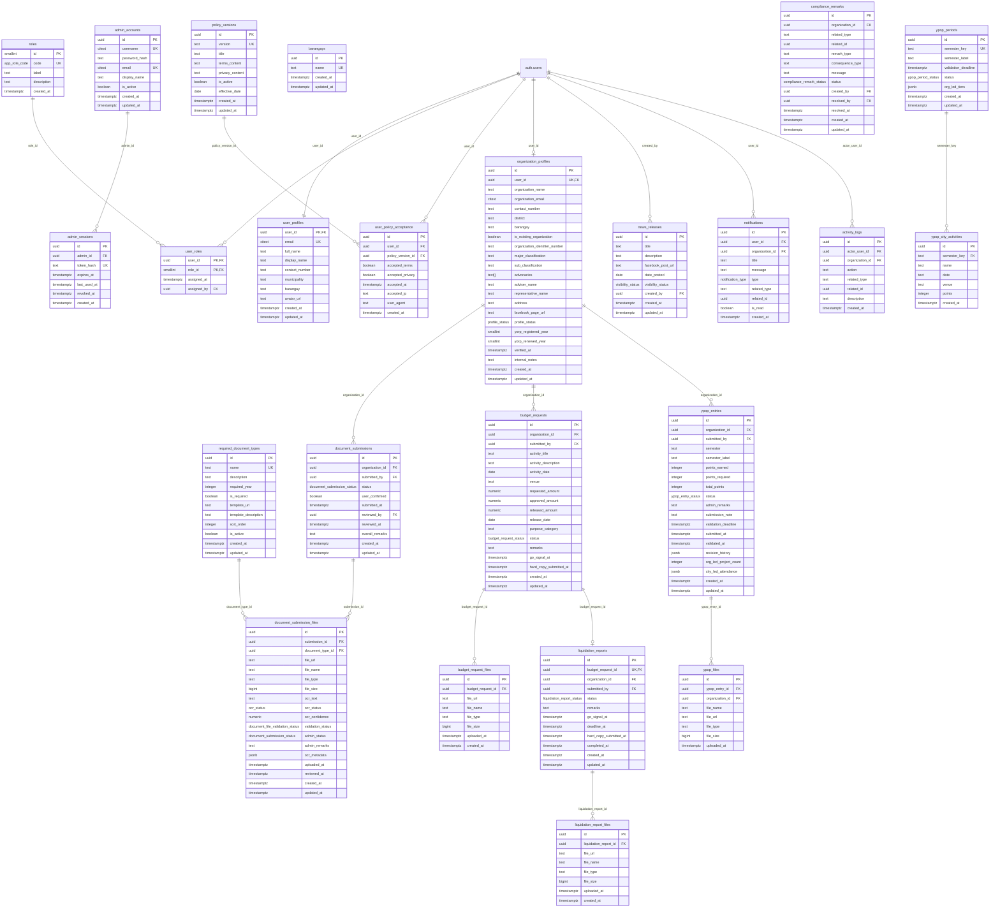
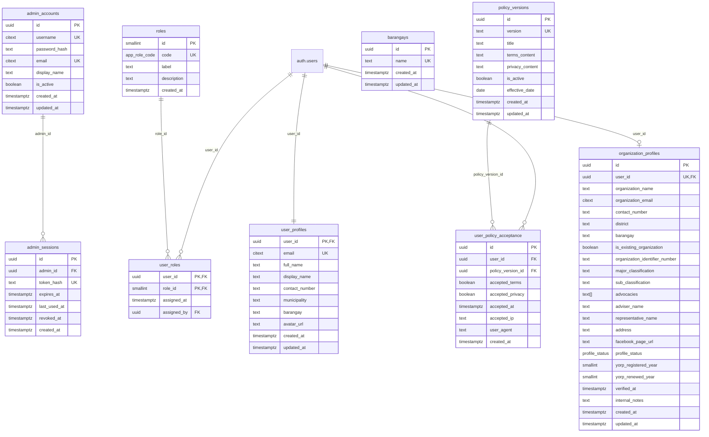
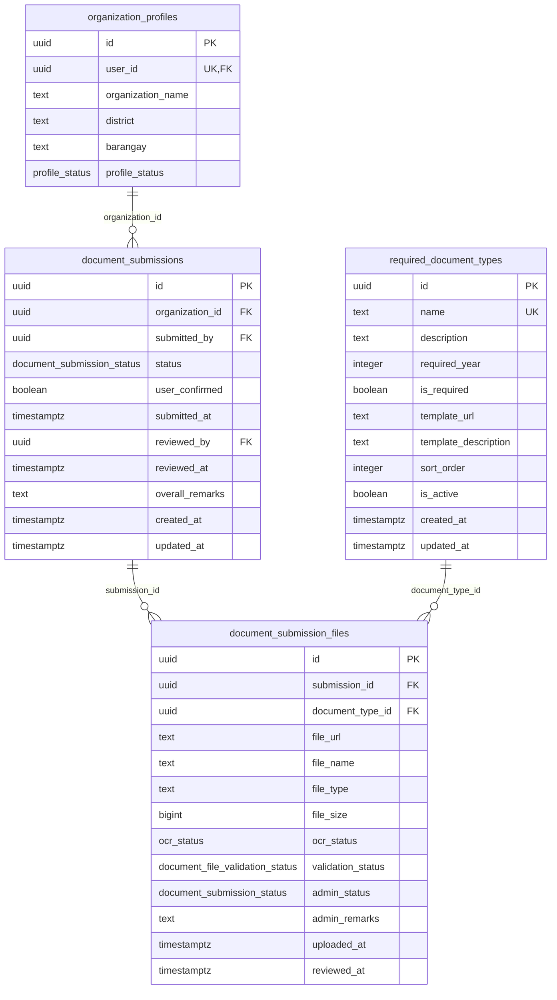
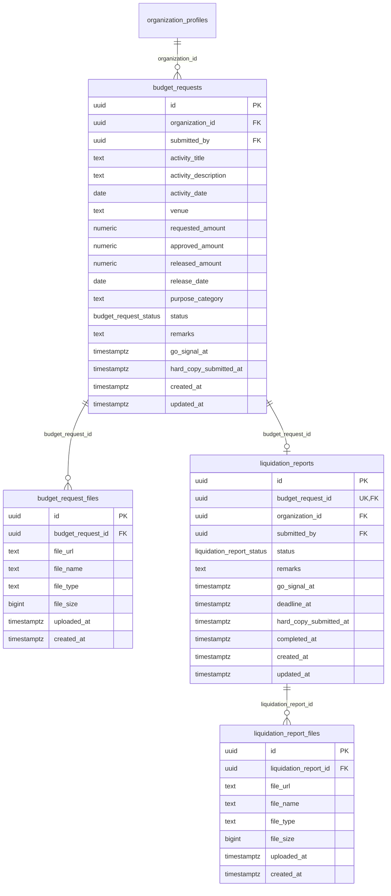
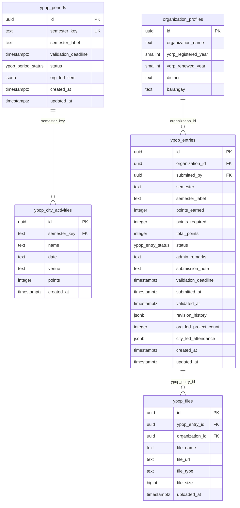
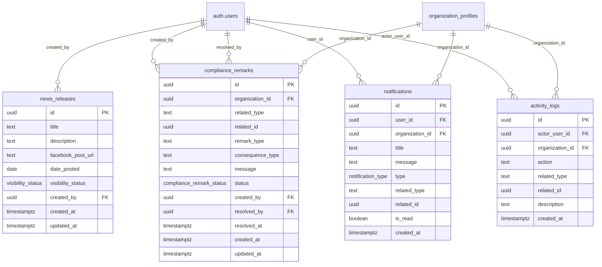

# 3.2.4 Database Schema

The database schema describes the tables that support the current LYDO Connect workflow. For this chapter, the schema is presented according to the actual organization-focused workflow reflected in the application: authentication and policy acceptance, organization registration and compliance submission, budget request and liquidation processing, YPOP submission and validation, YORP-related organization registry fields, template and news management, notifications, and activity logging. Legacy compatibility tables that are not part of the current workflow narrative are intentionally excluded from the main discussion.

Budget allocation monitoring is derived mainly from the `budget_requests` and `organization_profiles` tables, especially the `released_amount`, `district`, and `barangay` fields. YORP registry tracking in the current workflow is stored through organization-level fields rather than a separate registry table.

## Overall Database Schema

## Subpart 1. Authentication, Users, Policies, and Organization Registration

This subpart shows the access-control records, policy agreement records, and the main organization registration profile.

## Figure 17.2. Entity Relationship Diagram of Authentication, Users, Policies, and Organization Registration

## Subpart 2. Compliance Documents and Templates

This subpart shows the organization compliance workflow from template management to file submission and administrative review.

## Figure 17.3. Entity Relationship Diagram of Compliance Documents and Templates

## Subpart 3. Budget Request and Liquidation Workflow

This subpart shows the request, release, and liquidation cycle used for finance processing and barangay-level budget monitoring.

## Figure 17.4. Entity Relationship Diagram of Budget Request and Liquidation Workflow

## Subpart 4. YPOP Validation and YORP Registry Support

This subpart shows the YPOP cycle records used for organization submissions, city activity references, and administrative validation. The current YORP registry support is represented through the `yorp_registered_year` and `yorp_renewed_year` fields in `organization_profiles`.

## Figure 17.5. Entity Relationship Diagram of YPOP Validation and YORP Registry Support

## Subpart 5. News, Notifications, Remarks, and Activity Logs

This subpart groups the tables used for published portal updates, workflow remarks, user notifications, and audit-ready activity history.

## Figure 17.6. Entity Relationship Diagram of News, Notifications, Remarks, and Activity Logs

## Core Tables

- `roles`
- `user_roles`
- `user_profiles`
- `admin_accounts`
- `admin_sessions`
- `policy_versions`
- `user_policy_acceptance`
- `barangays`
- `organization_profiles`
- `required_document_types`
- `document_submissions`
- `document_submission_files`
- `budget_requests`
- `budget_request_files`
- `liquidation_reports`
- `liquidation_report_files`
- `ypop_periods`
- `ypop_city_activities`
- `ypop_entries`
- `ypop_files`
- `news_releases`
- `compliance_remarks`
- `notifications`
- `activity_logs`

## Key Notes

- `PK` means primary key.
- `FK` means foreign key.
- `UK` means unique key.
- Composite unique constraints are used for `user_policy_acceptance (user_id, policy_version_id)` and `document_submission_files (submission_id, document_type_id)`.
- `budget_requests` to `liquidation_reports` is a one-to-one workflow link because each budget request can have at most one liquidation report.
- YORP registry support is stored directly in `organization_profiles` through `is_existing_organization`, `organization_identifier_number`, `yorp_registered_year`, and `yorp_renewed_year`.
- Document templates are represented by active records in `required_document_types`, using `template_url` and `template_description`.
- YPOP workflow records are separated into reference periods, city activities, organization entries, and uploaded proof files.

## Summary

The current schema is limited to the tables that support the present LYDO Connect workflow for organization registration and internal LYDO operations. Legacy compatibility tables may still exist in the implementation, but they are not emphasized in this chapter when they do not contribute to the current workflow narrative.
