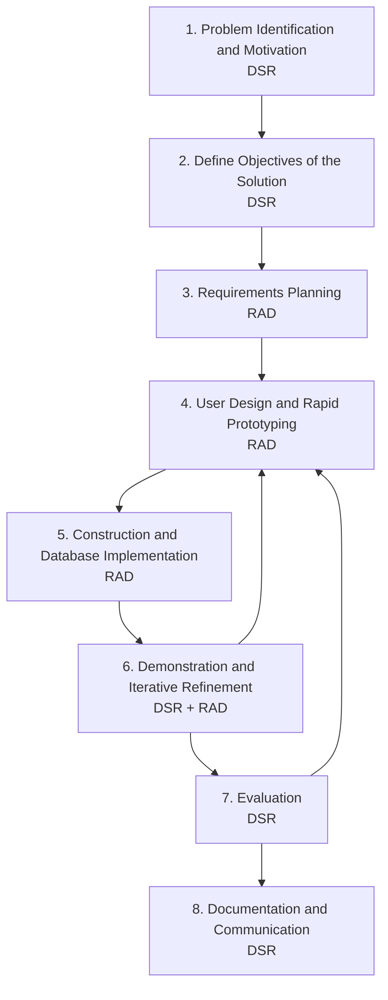

# 3.3.1 Process Model

The process model for LYDO Connect maps the study's development work into a hybrid DSR and RAD cycle. The process begins with problem identification and ends with evaluation and communication of the artifact.

## Hybrid DSR-RAD Process Model

## Phase Description

### 1. Problem Identification and Motivation

The study identifies the need for a centralized web platform that can address fragmented youth information dissemination, participation tracking, transparency publication, and citizen concern handling.

### 2. Define Objectives of the Solution

The desired solution is defined as a role-based youth governance and transparency management system that combines public access, administrative record management, verified Pasig youth organization information viewing, participation workflows, policy agreement tracking, registration synchronization support, and accountability controls.

### 3. Requirements Planning

System requirements, user roles, datasets, and module boundaries are established. At this stage, the researchers determine the needed public modules, admin modules, data entities, and data dependencies, including policy agreement records, organization detail fields, verified source references, registration sync fields, and audit requirements.

### 4. User Design and Rapid Prototyping

Prototype pages, data views, and workflow drafts are created and revised. This includes route structures, forms, listing pages, record pages, dashboards, policy agreement modal behavior, registration monitoring, external sheet preview, and admin interfaces, with read-centric organization detail workflows (`View Organization Info` and `Inspect Verified Source Reference`).

### 5. Construction and Database Implementation

The approved designs are implemented using the chosen technologies. Database tables, triggers, validation rules, RPC functions, application pages, registration worker logic, policy acceptance logic, and module behavior are developed during this phase.

### 6. Demonstration and Iterative Refinement

The system is demonstrated to intended users or reviewers. Feedback is used to revise forms, workflows, schema details, access rules, sync handling, policy agreement copy, and visual presentation, with emphasis on clarity and credibility of organization information.

### 7. Evaluation

The working artifact is assessed through functional testing, quality-based testing, and user evaluation using appropriate software quality criteria.

### 8. Documentation and Communication

The final system, methodology, findings, and technical outputs are documented for manuscript submission, presentation, and future maintenance.

## Summary

This process model is appropriate because it reflects both the research nature of the study and the iterative way LYDO Connect is actually developed.
