# TADZ Assigned Sections (Chapter 3 Draft)

Source of truth: `supabase/schema_supabase_all_in_one.sql` (generated 2026-04-25).

This file consolidates all sections assigned to **TADZ** in clean manuscript-ready format:
1. Database Schema
2. Data Dictionary
3. Development Methodology
4. Statistical Treatments

## 3.2.4 Database Schema

The database schema of LYDO Connect is presented through an **Entity Relationship Diagram (ERD)**, similar to the manuscript format where the section shows the data entities and their relationships in one figure.

### Entity Relationship Diagram

```mermaid
erDiagram
    AUTH_USERS ||--|| USER_PROFILES : has
    AUTH_USERS ||--o{ USER_ROLES : assigned
    ROLES ||--o{ USER_ROLES : defines

    BARANGAYS ||--o{ USER_PROFILES : locates
    BARANGAYS ||--o{ PROGRAMS : hosts
    BARANGAYS ||--o{ EVENTS : hosts
    BARANGAYS ||--o{ ORGANIZATIONS : scopes
    BARANGAYS ||--o{ BARANGAY_FINANCIALS : records
    BARANGAYS ||--o{ BARANGAY_YOUTH_METRICS : summarizes
    BARANGAYS ||--o{ COMPLIANCE_BOARD_STATUS : monitors
    BARANGAYS ||--o{ MONTHLY_COMPLIANCE : tracks

    OFFICES ||--o{ DISCLOSURE_DOCUMENTS : issues
    OFFICES ||--o{ SERVICE_ADVISORIES : posts

    AUTH_USERS ||--o{ PROGRAMS : creates
    AUTH_USERS ||--o{ EVENTS : creates
    AUTH_USERS ||--o{ ORGANIZATIONS : creates

    AUTH_USERS ||--o{ EVENT_REGISTRATIONS : registers
    EVENTS ||--o{ EVENT_REGISTRATIONS : receives

    AUTH_USERS ||--o{ PROGRAM_REGISTRATIONS : registers
    PROGRAMS ||--o{ PROGRAM_REGISTRATIONS : receives

    AUTH_USERS ||--o{ USER_PROGRAM_MEMBERSHIPS : joins
    PROGRAMS ||--o{ USER_PROGRAM_MEMBERSHIPS : includes

    AUTH_USERS ||--o{ USER_ORG_MEMBERSHIPS : joins
    ORGANIZATIONS ||--o{ USER_ORG_MEMBERSHIPS : includes

    DISCLOSURE_DOCUMENTS ||--o{ DOCUMENT_DOWNLOADS : downloaded_as
    DISCLOSURE_DOCUMENTS ||--o{ MONTHLY_COMPLIANCE : referenced_by

    TICKET_TYPES ||--o{ CITIZEN_TICKETS : classifies
    AUTH_USERS ||--o{ CITIZEN_TICKETS : creates_or_assigned

    AUTH_USERS ||--o{ AUDIT_LOGS : performs

    ROLES {
      smallint id PK
      app_role_code code UK
      text label
    }

    USER_PROFILES {
      uuid user_id PK
      citext email UK
      text full_name
      uuid barangay_id FK
    }

    PROGRAMS {
      uuid id PK
      text slug UK
      text title
      program_status status
      uuid barangay_id FK
    }

    EVENTS {
      uuid id PK
      text slug UK
      text title
      event_status status
      uuid barangay_id FK
    }

    ORGANIZATIONS {
      uuid id PK
      text slug UK
      text name
      organization_status status
      uuid barangay_id FK
    }

    EVENT_REGISTRATIONS {
      uuid id PK
      uuid user_id FK
      uuid event_id FK
      registration_status registration_status
    }

    PROGRAM_REGISTRATIONS {
      uuid id PK
      uuid user_id FK
      uuid program_id FK
      registration_status registration_status
    }

    DISCLOSURE_DOCUMENTS {
      uuid id PK
      text doc_code UK
      disclosure_doc_type document_type
      int fiscal_year
      quarter_code quarter
      uuid office_id FK
    }

    CITIZEN_TICKETS {
      uuid id PK
      text reference_no UK
      smallint type_id FK
      ticket_status status
    }

    AUDIT_LOGS {
      uuid id PK
      uuid actor_user_id FK
      text operation
      text table_name
    }
```

*Figure 0. Entity Relationship Diagram of LYDO Connect*

### Brief Schema Notes

- The ERD is based on the implemented Supabase schema (`schema_supabase_all_in_one.sql`).
- Core modules are grouped into identity/access, youth participation, transparency/compliance, citizen desk, and audit/accountability.
- The diagram reflects the normalized relational structure used by both the public portal and admin portal.

## 3.2.5 Data Dictionary

Best-practice structure used:
- **Chapter 3 body:** contains representative core tables for readability.
- **Appendix:** contains the complete all-table dictionary from the implemented schema.

Full appendix file: `Methodology/TADZ_Data_Dictionary_Full_Appendix.md`

The following data dictionary follows the requested thesis-table format.

### Table Name: `user_profiles`
**Table Description:** Stores profile details of authenticated users.
**Related Table:** `auth.users`, `barangays`

| Key | Field Name | Data Type | Length | Optional | Default Value | Field Validation | Description | Sample Data |
|---|---|---|---|---|---|---|---|---|
| PK, FK | user_id | uuid | 36 | No | none | must exist in `auth.users(id)` | Unique user identifier | `a3e1e8ee-6f2b-4e43-b99f-a6f58db1c901` |
|  | email | citext | 254 | No | none | unique, valid email format | User email address | `juan.delacruz@email.com` |
|  | full_name | text | variable | Yes | null | none | Full legal name | `Juan Dela Cruz` |
|  | display_name | text | variable | Yes | null | none | Name shown in UI | `Juan` |
|  | contact_number | text | 13 to 16 | Yes | null | app-level PH mobile format | Mobile/contact number | `+639171234567` |
| FK | barangay_id | uuid | 36 | Yes | null | references `barangays(id)` | Linked barangay | `5c7c7cb0-0ff4-4b77-9db0-630f8e1f0f60` |
|  | municipality | text | variable | No | `Metro Manila` | non-empty in UI | Municipality/city | `San Mateo` |
|  | notifications | boolean | 1 | No | `true` | boolean only | Notification preference | `true` |
|  | show_email_public | boolean | 1 | No | `false` | boolean only | Public profile email visibility | `false` |
|  | created_at | timestamptz | datetime | No | `now()` | system-generated | Record creation timestamp | `2026-04-29 19:10:24+08` |
|  | updated_at | timestamptz | datetime | No | `now()` | auto-updated trigger | Last update timestamp | `2026-04-29 19:35:02+08` |

*Table 0. Database Table of user_profiles*

### Table Name: `programs`
**Table Description:** Stores youth program master records posted in the portal.
**Related Table:** `barangays`, `auth.users`

| Key | Field Name | Data Type | Length | Optional | Default Value | Field Validation | Description | Sample Data |
|---|---|---|---|---|---|---|---|---|
| PK | id | uuid | 36 | No | `gen_random_uuid()` | unique | Program primary key | `f9f6db7f-8f66-4bf6-8b95-83832e5b8c5c` |
|  | slug | text | variable | No | none | unique | URL-safe program code | `hirayang-kabataan-yep` |
|  | title | text | variable | No | none | non-empty | Program title | `Hirayang Kabataan Youth Empowerment Program` |
|  | sector | text | variable | No | none | non-empty | Program sector/category | `LYDO` |
|  | description | text | variable | No | `''` | none | Program details | `Core empowerment program...` |
|  | start_date | date | date | Yes | null | <= `end_date` when both present | Program start date | `2026-05-10` |
|  | end_date | date | date | Yes | null | >= `start_date` when both present | Program end date | `2026-05-12` |
|  | status | enum(program_status) | fixed | No | `published` | `draft/published/archived` | Publication state | `published` |
| FK | barangay_id | uuid | 36 | Yes | null | references `barangays(id)` | Target barangay | `5c7c7cb0-0ff4-4b77-9db0-630f8e1f0f60` |
| FK | created_by | uuid | 36 | Yes | null | references `auth.users(id)` | Creator account | `2c7eec2a-d9de-4a9e-9185-37e1e5be20d4` |
|  | start_time | time | hh:mm:ss | Yes | null | <= `end_time` when both present | Start time | `09:00:00` |
|  | end_time | time | hh:mm:ss | Yes | null | >= `start_time` when both present | End time | `17:00:00` |

*Table 0. Database Table of programs*

### Table Name: `events`
**Table Description:** Stores event records, including schedule and capacity.
**Related Table:** `barangays`, `auth.users`

| Key | Field Name | Data Type | Length | Optional | Default Value | Field Validation | Description | Sample Data |
|---|---|---|---|---|---|---|---|---|
| PK | id | uuid | 36 | No | `gen_random_uuid()` | unique | Event primary key | `d8be3412-20bc-4d75-a895-c3ce1f3c8f67` |
|  | slug | text | variable | No | none | unique | URL-safe event code | `siklab-opening-games-2026` |
|  | title | text | variable | No | none | non-empty | Event title | `SIKLAB Opening Games` |
|  | event_date | date | date | Yes | null | valid date | Event date | `2026-05-05` |
|  | capacity | integer | up to 10 digits | Yes | null | > 0 when not null | Max registrants | `300` |
|  | status | enum(event_status) | fixed | No | `upcoming` | `draft/upcoming/past/cancelled` | Event state | `upcoming` |
| FK | barangay_id | uuid | 36 | Yes | null | references `barangays(id)` | Event barangay scope | `5c7c7cb0-0ff4-4b77-9db0-630f8e1f0f60` |
|  | location_latitude | numeric(9,6) | 9,6 | Yes | null | between -90 and 90 | Latitude | `14.683000` |
|  | location_longitude | numeric(9,6) | 9,6 | Yes | null | between -180 and 180 | Longitude | `121.118000` |

*Table 0. Database Table of events*

### Table Name: `event_registrations`
**Table Description:** Stores user registrations for events.
**Related Table:** `events`, `auth.users`, `barangays`

| Key | Field Name | Data Type | Length | Optional | Default Value | Field Validation | Description | Sample Data |
|---|---|---|---|---|---|---|---|---|
| PK | id | uuid | 36 | No | `gen_random_uuid()` | unique | Registration primary key | `54a08f6f-a20a-4f61-b60a-f9b11ce92c20` |
| FK | user_id | uuid | 36 | No | none | references `auth.users(id)` | Registrant account | `2c7eec2a-d9de-4a9e-9185-37e1e5be20d4` |
| FK | event_id | uuid | 36 | No | none | references `events(id)` | Registered event | `d8be3412-20bc-4d75-a895-c3ce1f3c8f67` |
|  | full_name | text | variable | No | none | minimum 2 chars (RPC validation) | Registrant name | `Juan Dela Cruz` |
|  | email | citext | 254 | No | none | valid email format | Registrant email | `juan@email.com` |
|  | contact_number | text | variable | No | none | PH mobile pattern (RPC validation) | Mobile number | `+639171234567` |
|  | registration_status | enum(registration_status) | fixed | No | `registered` | enum values only | Registration state | `registered` |
|  | source | text | variable | No | `portal_direct` | one of `portal_direct/admin_csv_sync/imported` | Source of entry | `portal_direct` |
|  | gform_sync_status | text | variable | No | `pending` | one of `pending/synced/failed/skipped` | External sync status | `pending` |

*Table 0. Database Table of event_registrations*

### Table Name: `disclosure_documents`
**Table Description:** Stores transparency and compliance documents for public access.
**Related Table:** `barangays`, `offices`, `auth.users`

| Key | Field Name | Data Type | Length | Optional | Default Value | Field Validation | Description | Sample Data |
|---|---|---|---|---|---|---|---|---|
| PK | id | uuid | 36 | No | `gen_random_uuid()` | unique | Document primary key | `4f2d8bc9-78fe-4f90-b7aa-82ebef08db7f` |
|  | doc_code | text | variable | No | none | unique | Human-readable document code | `doc-101` |
|  | title | text | variable | No | none | non-empty | Document title | `SK Midyear Budget Utilization Statement` |
|  | document_type | enum(disclosure_doc_type) | fixed | No | none | enum values only | Disclosure category | `financial_statement` |
|  | fiscal_year | integer | 4 digits | No | none | between 2000 and 2100 | Covered fiscal year | `2026` |
|  | quarter | enum(quarter_code) | fixed | No | none | `Q1/Q2/Q3/Q4` | Covered quarter | `Q2` |
| FK | office_id | uuid | 36 | Yes | null | references `offices(id)` | Issuing office | `8d4f29c0-c7c0-4f46-bf8c-5d9dd0d6f4a9` |
|  | public_url | text | variable | Yes | null | URL format expected | Public file URL/path | `/disclosure-registry-test.pdf` |
|  | document_type_other | text | variable | Yes | null | required if `document_type='other'` | Custom type label | `Memorandum` |

*Table 0. Database Table of disclosure_documents*

### Table Name: `citizen_tickets`
**Table Description:** Stores citizen requests, complaints, and service tickets.
**Related Table:** `ticket_types`, `auth.users`

| Key | Field Name | Data Type | Length | Optional | Default Value | Field Validation | Description | Sample Data |
|---|---|---|---|---|---|---|---|---|
| PK | id | uuid | 36 | No | `gen_random_uuid()` | unique | Ticket primary key | `2f7b8f44-bf5e-4ec4-8773-5e0b60d1942b` |
|  | reference_no | text | variable | No | generated by trigger | unique | Public tracking reference | `LYDO-100245` |
| FK | type_id | smallint | up to 5 digits | No | none | references `ticket_types(id)` | Ticket classification | `1` |
|  | subject | text | variable | No | none | non-empty | Ticket subject | `Request for SK budget breakdown` |
|  | requester_email | citext | 254 | No | none | valid email required | Requester email | `citizen1@example.com` |
|  | status | enum(ticket_status) | fixed | No | `received` | enum values only | Ticket workflow status | `in_progress` |
|  | priority | smallint | 1 digit | No | `3` | between 1 and 5 | Service priority | `2` |
| FK | assigned_to_user_id | uuid | 36 | Yes | null | references `auth.users(id)` | Assigned staff user | `710fc677-f5ae-498e-9ec4-90f343db5d65` |
|  | resolved_at | timestamptz | datetime | Yes | null | set by trigger when resolved/closed | Resolution timestamp | `2026-06-16 09:05:00+08` |

*Table 0. Database Table of citizen_tickets*

### Table Name: `monthly_compliance`
**Table Description:** Stores monthly compliance submission statuses per barangay.
**Related Table:** `barangays`, `disclosure_documents`, `auth.users`

| Key | Field Name | Data Type | Length | Optional | Default Value | Field Validation | Description | Sample Data |
|---|---|---|---|---|---|---|---|---|
| PK | id | uuid | 36 | No | `gen_random_uuid()` | unique | Compliance row primary key | `5d5e6a55-8f59-458d-8caf-f4c4af8db4ba` |
| FK | barangay_id | uuid | 36 | No | none | references `barangays(id)` | Barangay scope | `5c7c7cb0-0ff4-4b77-9db0-630f8e1f0f60` |
|  | fiscal_year | integer | 4 digits | No | none | between 2000 and 2100 | Reporting year | `2026` |
|  | month_no | smallint | 2 digits | No | none | between 1 and 12 | Reporting month | `6` |
|  | mfr_status | enum(submission_state) | fixed | No | `missing` | enum values only | MFR submission state | `submitted` |
|  | mil_status | enum(submission_state) | fixed | No | `missing` | enum values only | MIL submission state | `late` |
|  | completion_percent | smallint | 3 digits | No | `0` | between 0 and 100 | Overall completion score | `80` |
| FK | report_document_id | uuid | 36 | Yes | null | references `disclosure_documents(id)` | Linked report document | `4f2d8bc9-78fe-4f90-b7aa-82ebef08db7f` |

*Table 0. Database Table of monthly_compliance*

### Table Name: `audit_logs`
**Table Description:** Stores row-level change history for accountability.
**Related Table:** `auth.users` and audited public tables

| Key | Field Name | Data Type | Length | Optional | Default Value | Field Validation | Description | Sample Data |
|---|---|---|---|---|---|---|---|---|
| PK | id | uuid | 36 | No | `gen_random_uuid()` | unique | Audit log primary key | `9f0fd1da-e26c-4856-bb1d-129c1f678882` |
|  | occurred_at | timestamptz | datetime | No | `now()` | system-generated | When change happened | `2026-04-29 20:03:44+08` |
| FK | actor_user_id | uuid | 36 | Yes | null | references `auth.users(id)` | User who performed action | `710fc677-f5ae-498e-9ec4-90f343db5d65` |
|  | operation | text | 6 | No | none | one of `INSERT/UPDATE/DELETE` | Type of change | `UPDATE` |
|  | table_name | text | variable | No | none | non-empty | Target table | `programs` |
|  | row_pk | jsonb | variable | No | `'{}'::jsonb` | valid json | Primary key snapshot | `{"id":"f9f6db7f-..."}` |
|  | changed_fields | text[] | variable | Yes | null | valid array | Fields changed in update | `{title,status}` |
|  | old_data | jsonb | variable | Yes | null | valid json | Previous row snapshot | `{"title":"Old"}` |
|  | new_data | jsonb | variable | Yes | null | valid json | New row snapshot | `{"title":"New"}` |

*Table 0. Database Table of audit_logs*

## 3.3 Development Methodology

### 3.3.1 Process Model

The study adopts a **hybrid Design Science Research (DSR) and Rapid Application Development (RAD)** process model.

- **DSR as research framework**: identifies the governance and information-management problem, defines solution objectives, develops the artifact, demonstrates the artifact in context, and evaluates quality and usefulness.
- **RAD as development strategy**: delivers the system through short iterative cycles of prototyping, validation, revision, and release.

This combined model is appropriate for LYDO Connect because the project has multiple modules that evolved incrementally: public pages, admin portal, registrations, transparency records, analytics, citizen desk, and integration functions. Database migrations and policy updates in the schema history also confirm iterative development rather than a rigid one-pass model.

#### Process Flow Used in the Project

1. **Problem and Requirement Definition**
- Gathered requirements from LYDO workflow context, transparency obligations, and participation monitoring needs.

2. **Rapid Prototype Construction**
- Initial portal and admin modules were built quickly to validate navigation, forms, and core records.

3. **Schema and Access Control Iteration**
- SQL migrations added normalized tables, enums, constraints, RLS policies, and triggers.

4. **Module Refinement and Integration**
- Registration flows, disclosure management, ticketing, audit trails, and sync automation were integrated.

5. **Testing and Evaluation Preparation**
- Outputs were aligned to quality criteria and evaluation instruments for acceptability testing.

### 3.3.2 Development Tools

The following tools were used in the implementation and maintenance of LYDO Connect:

| Tool Category | Actual Tool(s) Used | Purpose in Project |
|---|---|---|
| Programming Language | TypeScript, JavaScript, SQL, Python | Frontend development, database logic/migrations, and sync worker automation |
| Database Platform | Supabase PostgreSQL | Central relational data store, authentication linkage, RLS, storage integration |
| Framework and Build Tool | React + Vite | Modular single-page app development and optimized builds |
| UI and Styling | Tailwind CSS + shadcn/ui component layer | Responsive, reusable interface components for user and admin portals |
| Backend/API Layer | Supabase APIs (Auth, PostgREST, Storage, Realtime) + SQL RPC functions | Authentication, CRUD access, file handling, realtime-compatible backend operations |
| Development Environment | Visual Studio Code | Main IDE for coding, debugging, and source control integration |
| Version Control | Git + GitHub repository workflow | Change tracking, collaboration, and rollback-safe history |
| Testing/Validation Support | Vitest (configured), SQL assertions/migration checks | Basic app-level and schema-level validation |
| Automation Utility | Python worker scripts (`worker/gform_sync_worker.py`) | Registration sync handling with Google Forms/Sheets workflow |
| Deployment Surface | Vercel (frontend) + Supabase cloud services | Hosting, managed database, and storage access |

#### Tool Selection Justification

- The stack supports **rapid iteration** (RAD fit), especially for frequent schema and UI updates.
- Supabase enables **production-grade relational controls** needed by governance data.
- SQL-first migrations ensure **traceable and reproducible** database evolution.
- React + Vite supports fast front-end iteration for both public and admin workflows.

---

## 3.7.6 Statistical Treatments

For this study, statistical treatment focuses on **descriptive analysis** appropriate for design-and-development evaluation.

### 1. Statistical Tools

- **Frequency and Percentage**: for respondent profile summaries.
- **Weighted Mean**: for acceptability scores per criterion (based on Likert-scale responses).
- **Standard Deviation**: for variability/consistency of responses.

### 2. Decision Basis

- Criteria are interpreted using pre-defined Likert verbal interpretations.
- Overall system acceptability is determined from aggregated weighted means.
- Qualitative comments are grouped thematically to support revisions.

### 3. Note on Inferential Tests

Inferential tests (for example, `t-test` or `z-test`) are not required by default for this capstone design unless the final adviser-approved research design explicitly compares respondent groups.

---

## Ready-to-Paste Note

If needed, I can also split this file into section-specific `.md` files (`3.2.4`, `3.2.5`, `3.3.1`, `3.3.2`, `3.7.6`) to match your manuscript structure one-to-one.
