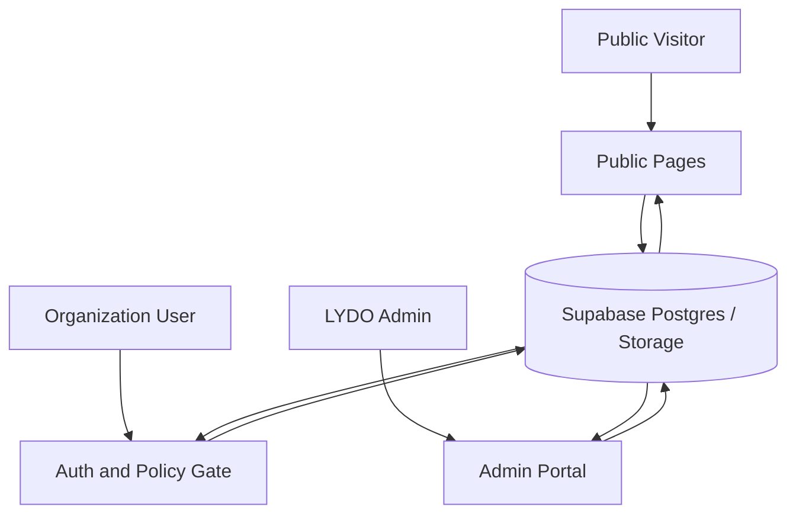

# Data Flow Diagram

This section summarizes the current LYDO Connect data flow at a high level.

## Context Flow

## Current Data Flows

- Public visitors view published news releases and transparency posts.
- Organization users sign up, sign in, accept the active policy, update profiles, upload documents, submit budget requests, and file liquidation reports after approval.
- Admins review organization profiles, documents, budget requests, liquidation reports, news releases, transparency posts, and required document templates.
- Released budget data is grouped by barangay and district for monitoring in the admin portal.
- Supabase stores profiles, submissions, requests, reports, content records, notifications, remarks, logs, and uploaded file references.

## Data Flow Summary

1. A user enters the system through authentication or public pages.
2. Protected workflows route through policy acceptance and role-based access.
3. Transactions such as submissions, requests, and reports are saved in Supabase.
4. Admin review actions update statuses, generate notifications, and add logs.
5. Public content remains visible according to visibility status, while private workflow data stays protected.

## Scope Note

Legacy flows from earlier drafts are intentionally excluded from this diagram.
