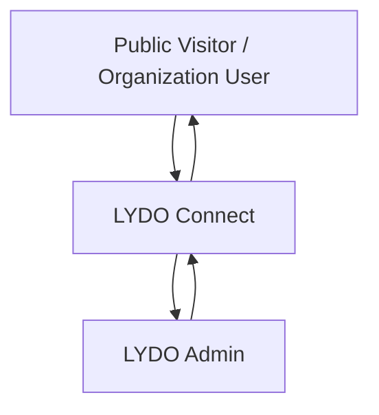

# Data Flow Diagram

This section summarizes the current LYDO Connect data flow at a high level.

## Context Flow

## Current Data Flows

- Public visitors view published news releases and public transparency posts.
- Organization users sign in, accept policy, manage profiles, upload documents, submit budget requests, and upload liquidation files after budget approval.
- Admins review submissions, manage content, update statuses, and maintain templates and logs.
- Supabase stores profiles, documents, budget requests, liquidation records, news releases, transparency posts, notifications, and activity logs.

## Scope Note

Legacy flows from earlier drafts are intentionally excluded from this diagram.
