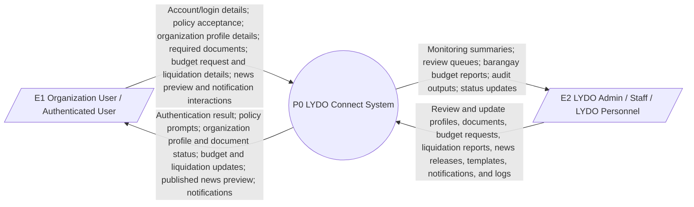
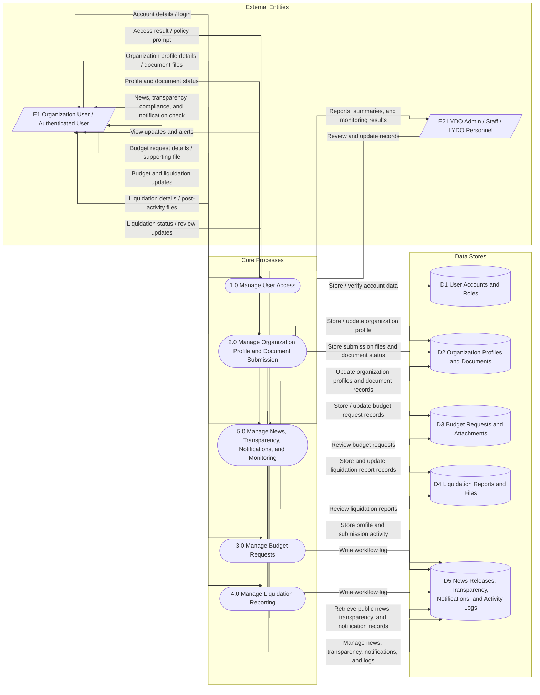
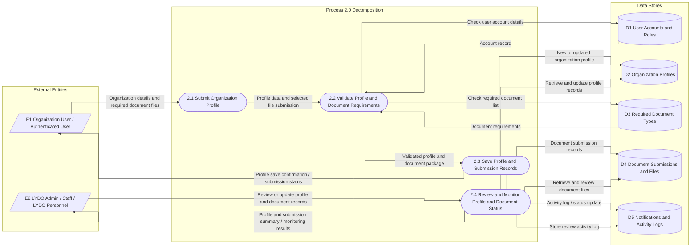

# Data Flow Diagram

This section presents the Data Flow Diagram (DFD) of LYDO Connect in three levels: the Context Diagram (Level 0), DFD Level 1, and DFD Level 2 of Process 2.0 Organization Profile and Document Submission. The diagrams follow the current site scope and focus on account access, organization profile and document submission, budget request and liquidation workflows, public information, notifications, and admin monitoring/reporting.

## External Entities

- `E1` Organization User / Authenticated User
- `E2` LYDO Admin / Staff / LYDO Personnel

## Figure 1. Context Diagram (Level 0)

The context diagram provides a top-level view of the LYDO Connect System and its external entities. The system interacts with two primary entities: the Organization User / Authenticated User, who submits login details, manages organization profile information, uploads required documents, prepares budget requests, submits liquidation reports, views news and transparency posts, and checks status updates; and the LYDO Admin / Staff / LYDO Personnel, who uses system outputs for monitoring, review, validation, and operations. In return, the system delivers access results, profile and document status, budget and liquidation updates, public news and transparency information, notifications, and administrative outputs such as monitoring summaries, review queues, reports, and audit logs.

## Figure 2. Data Flow Diagram Level 1

### Level 1 Overview

The Level 1 DFD presents the current LYDO Connect workflow in five core processes. It shows how user access, organization profile and document submission, budget requests, liquidation reporting, and public content or admin monitoring are handled through the available data stores.

- `1.0 Manage User Access`
  - Organization users and admins submit account details or login information to enter the system.
  - The process verifies account data in `D1 User Accounts and Roles` and returns the access result to the user.

- `2.0 Manage Organization Profile and Document Submission`
  - Organization users enter profile details and upload required documents through the protected portal.
  - The process stores and updates profile and submission data in `D2 Organization Profiles and Documents` and records activity in `D5 News Releases, Transparency, Notifications, and Activity Logs`.

- `3.0 Manage Budget Requests`
  - Organization users prepare and submit budget request details with supporting files.
  - The process stores budget request records in `D3 Budget Requests and Attachments` and writes workflow logs to `D5`.

- `4.0 Manage Liquidation Reporting`
  - Organization users submit liquidation details and post-activity files after budget release and approval.
  - The process stores liquidation records in `D4 Liquidation Reports and Files` and records the related status updates in `D5`.

- `5.0 Manage News, Transparency, Notifications, and Monitoring`
  - Youth/public users view news releases, transparency posts, compliance updates, and notifications.
  - Admin or staff users manage these records, review stored workflow data, and generate monitoring summaries and reports through `D5`.

## Figure 3. Data Flow Diagram Level 2 of Process 2.0 Organization Profile and Document Submission

### Process 2.0 Decomposition

The Level 2 DFD breaks Process 2.0 into smaller actions that reflect the actual organization profile and document submission workflow in the system.

- `2.1 Submit Organization Profile`
  - The organization user enters or updates the profile details linked to the account, including the organization name, contact information, address, classification, adviser, representative, and other required profile fields.

- `2.2 Validate Profile and Document Requirements`
  - The system validates the account-linked profile data and checks the required document list before allowing the submission to proceed.
  - This step helps ensure that the profile is complete and that the selected file matches the expected document type.

- `2.3 Save Profile and Submission Records`
  - The system stores the updated organization profile, saves the uploaded document record, and records the submission activity.
  - After saving, the system returns a confirmation or status update to the organization user.

- `2.4 Review and Monitor Profile and Document Status`
  - Admin or staff users review the saved organization profile and submitted documents.
  - They update review status when needed and monitor the results through the stored profile, submission, and activity log records.

## Data Flow Summary

1. Organization users enter the system through authentication, policy acceptance, and role-based access.
2. Organization profile data and required documents are validated before being stored and reviewed.
3. Budget requests and liquidation reports are handled as linked workflow records after the profile and document stage.
4. Published news releases, transparency posts, and notifications are retrieved for preview and alert purposes.
5. Admin staff review records, maintain reference data, and generate monitoring outputs and audit logs.

## Scope Note

The DFD matches the current LYDO Connect workflow and focuses on the modules currently available in the site.
