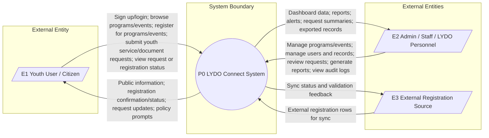
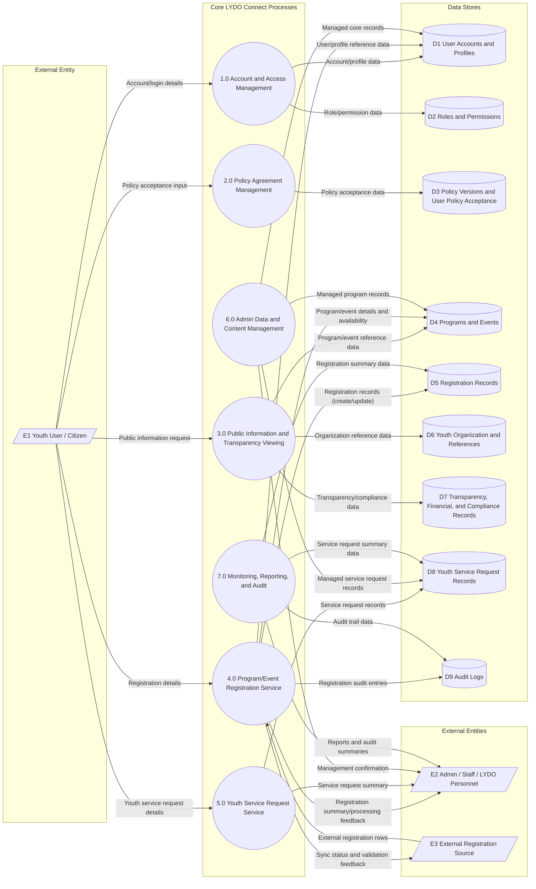
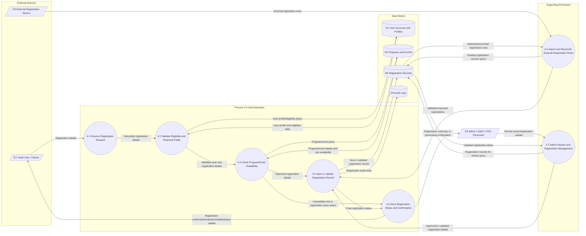

# Data Flow Diagram

## Overview

This section presents the Data Flow Diagram (DFD) of **LYDO Connect** in three levels: the **Context Diagram (Level 0)**, **DFD Level 1**, and **DFD Level 2 of Process 4.0 Program/Event Registration Service**. These diagrams show how youth users/citizens and admin/staff interact with the system for account access, policy agreement, public information browsing, program/event registration, youth service requests, administrative management, reporting, and audit logs.

## External Entities

- `E1` Youth User / Citizen
- `E2` Admin / Staff / LYDO Personnel
- `E3` External Registration Source

## Context Diagram (Level 0)

*Figure 1: Context Diagram*

## Data Flow Diagram Level 1

### Major Processes

- `1.0` Account and Access Management
- `2.0` Policy Agreement Management
- `3.0` Public Information and Transparency Viewing
- `4.0` Program/Event Registration Service
- `5.0` Youth Service Request Service
- `6.0` Admin Data and Content Management
- `7.0` Monitoring, Reporting, and Audit

### Data Stores

- `D1` User Accounts and Profiles
- `D2` Roles and Permissions
- `D3` Policy Versions and User Policy Acceptance
- `D4` Programs and Events
- `D5` Registration Records
- `D6` Youth Organization and References
- `D7` Transparency, Financial, and Compliance Records
- `D8` Youth Service Request Records
- `D9` Audit Logs

*Figure 2: Data Flow Diagram Level 1*

## Data Flow Diagram Level 2 of Process 4.0 Program/Event Registration Service

*Figure 3: Data Flow Diagram Level 2 of Process 4.0 Program/Event Registration Service*

### Program/Event Registration Service (4.0)

- Youth users/citizens submit registration details for available LYDO programs or events.
- The system validates the user profile, required fields, and eligibility requirements.
- The system checks the selected program/event details and available slots.
- Valid registrations are saved in `D5 Registration Records`.
- If external registration sources are used, imported rows are matched and reconciled with existing registration records.
- Admin/staff can review, approve, update, or manage registration records.
- The system sends confirmation, rejection, waitlist, or status updates to the youth user/citizen.
- Important registration actions are recorded in `D9 Audit Logs`.

### Receive Registration Request (4.1)

- Captures registration details submitted by the youth user/citizen.
- Passes submitted data to validation.

### Validate Eligibility and Required Fields (4.2)

- Checks user profile, required registration fields, and eligibility.
- Uses `D1 User Accounts and Profiles` as reference.

### Check Program/Event Availability (4.3)

- Checks selected program/event information and slot availability.
- Uses `D4 Programs and Events` as reference.

### Import and Reconcile External Registration Rows (4.4)

- Accepts rows from external registration sources, such as imported sheets or forms.
- Matches imported rows with existing records in `D5 Registration Records` to avoid duplicates.

### Save or Update Registration Record (4.5)

- Creates or updates registration records in `D5`.
- Sends important actions to `D9 Audit Logs`.

### Send Registration Status and Confirmation (4.6)

- Sends confirmation, rejection, waitlist, or status update to the youth user/citizen.
- Sends summaries or processing confirmation to admin/staff.

### Admin Review and Registration Management (4.7)

- Allows admin/staff to review, approve, update, or manage program/event registration records.
- Updates registration status in `D5 Registration Records`.
