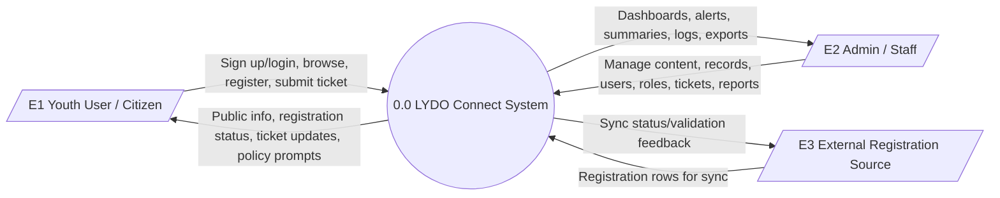
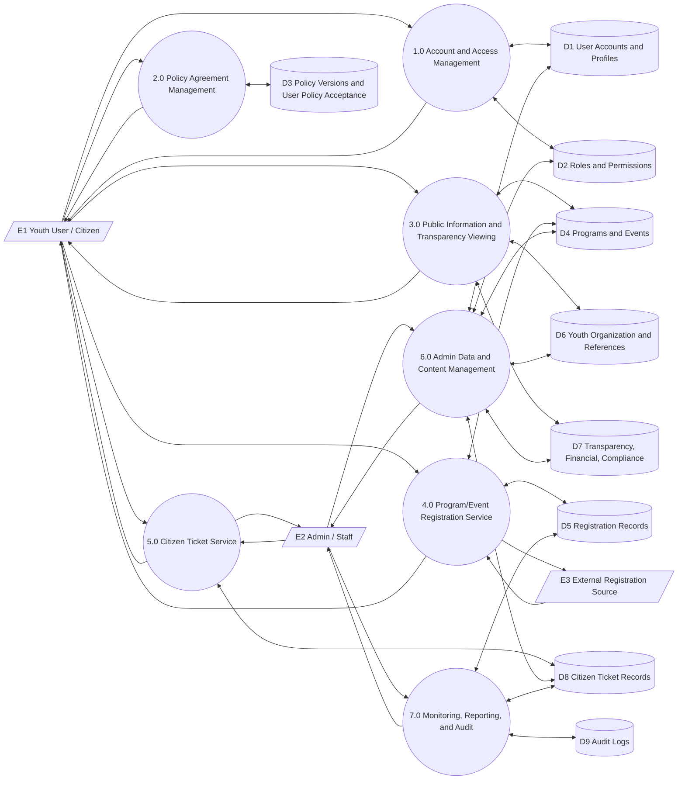
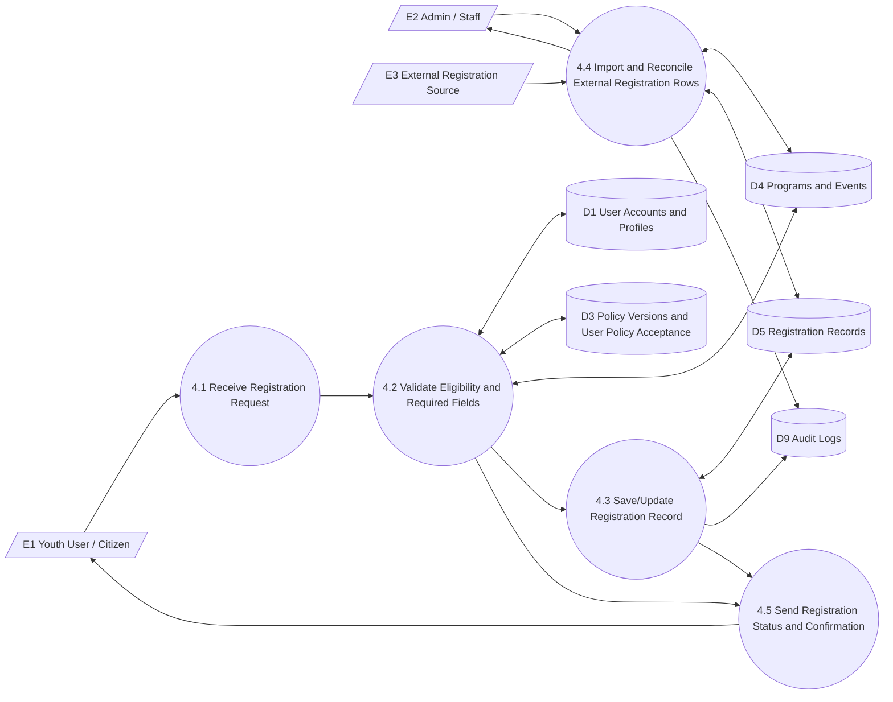

# Data Flow Diagram

## Overview

This section presents the Data Flow Diagram (DFD) of **LYDO Connect** to show how data moves between external entities, system processes, and internal data stores. Following the guide format, the presentation starts with a **Context Diagram**, then expands to **DFD Level 1**, and finally details a key process using **DFD Level 2**.

The DFD covers the implemented scope of the site, including account access, policy agreement, public information browsing, program/event registration, citizen ticket handling, administrative management, and audit-supported governance.

## External Entities

- `E1` Youth User / Citizen
- `E2` Admin / Staff (LYDO Personnel)
- `E3` External Registration Source (Google Forms/Sheets sync input, when enabled)

## Context Diagram (Level 0)

The context diagram treats LYDO Connect as a single process and shows its interaction with external entities.

## DFD Level 1

DFD Level 1 decomposes the system into major functional processes and connected data stores.

### Major Processes

- `1.0` Account and Access Management
- `2.0` Policy Agreement Management
- `3.0` Public Information and Transparency Viewing
- `4.0` Program/Event Registration Service
- `5.0` Citizen Ticket Service
- `6.0` Admin Data and Content Management
- `7.0` Monitoring, Reporting, and Audit

### Data Stores

- `D1` User Accounts and Profiles
- `D2` Roles and Permissions
- `D3` Policy Versions and User Policy Acceptance
- `D4` Programs and Events
- `D5` Registration Records
- `D6` Youth Organization and Reference Records
- `D7` Transparency, Financial, and Compliance Records
- `D8` Citizen Ticket Records
- `D9` Audit Logs

### Diagram

### Level 1 Flow Description

1. Youth users/citizens create accounts, log in, and access protected features through Process `1.0`, which validates identity using `D1` and access rules from `D2`.
2. Authenticated non-admin users pass through Process `2.0`, where active policy content is read and acceptance is recorded in `D3`.
3. Users consume programs, events, organization information, and transparency records through Process `3.0`, which retrieves data from `D4`, `D6`, and `D7`.
4. Registration actions are handled by Process `4.0`, which stores and updates participant records in `D5` while checking event/program context from `D4`. External sync data from `E3` is also processed here when enabled.
5. Service concerns and follow-ups are handled by Process `5.0`, which creates and updates ticket records in `D8`.
6. Administrative CRUD and governance actions are performed in Process `6.0` across operational stores (`D1`, `D2`, `D4`, `D6`, `D7`, `D8`).
7. Summaries, exports, and traceability are generated by Process `7.0` using `D5`, `D8`, and `D9` for accountability and reporting.

## DFD Level 2 (Process 4.0 Program/Event Registration Service)

DFD Level 2 expands Process `4.0` to show its internal sub-processes for registration capture, validation, persistence, sync support, and status delivery.

### Sub-Processes

- `4.1` Receive Registration Request
- `4.2` Validate Eligibility and Required Fields
- `4.3` Save/Update Registration Record
- `4.4` Import and Reconcile External Registration Rows
- `4.5` Send Registration Status and Confirmation

### Diagram

### Level 2 Flow Description

1. The youth user submits a registration request to `4.1`.
2. `4.2` checks user identity/profile (`D1`), required policy acceptance (`D3`), and event/program constraints (`D4`).
3. If valid, `4.3` writes the registration to `D5`; if invalid, `4.5` returns errors/instructions to the user.
4. For sync-enabled operations, `4.4` accepts rows from `E3`, reconciles duplicates or mismatches against `D4` and `D5`, and reports results to admin/staff (`E2`).
5. Successful transactions generate confirmation/status feedback to the user through `4.5`.
6. Significant registration updates and reconciliation actions are logged in `D9` for monitoring and accountability.

## Summary

The DFD set (Context, Level 1, and Level 2) demonstrates that LYDO Connect supports end-to-end data handling for public users and administrators: from access and consent, to registration and service operations, up to governance reporting and audit traceability.
