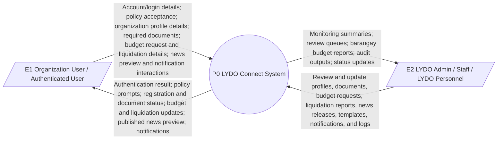
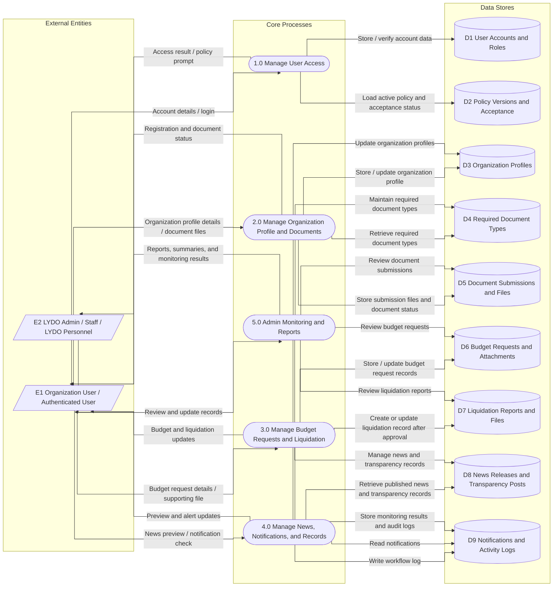
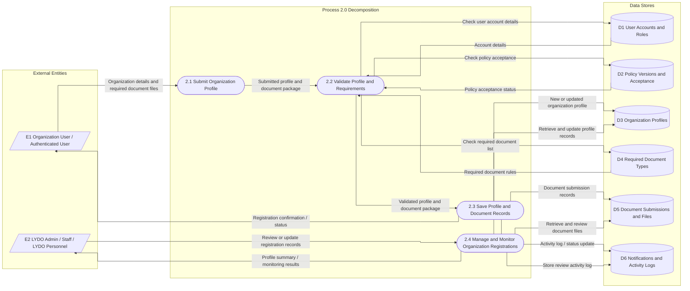

# Data Flow Diagram

This section presents the Data Flow Diagram (DFD) of LYDO Connect in three levels: the Context Diagram (Level 0), DFD Level 1, and DFD Level 2 of Process 2.0 Organization Profile and Document Submission. The diagrams follow the current site scope and focus on authenticated organization work, budget and liquidation processing, news previewing, notifications, and admin monitoring/reporting.

## External Entities

- `E1` Organization User / Authenticated User
- `E2` LYDO Admin / Staff / LYDO Personnel

## Figure 1. Context Diagram (Level 0)

## Figure 2. Data Flow Diagram Level 1

## Figure 3. Data Flow Diagram Level 2 of Process 2.0 Organization Profile and Document Submission

## Data Flow Summary

1. Organization users enter the system through authentication, policy acceptance, and role-based access.
2. Organization profile data and required documents are validated before being stored and reviewed.
3. Budget requests and liquidation reports are handled as linked workflow records after the profile and document stage.
4. Published news releases, transparency posts, and notifications are retrieved for preview and alert purposes.
5. Admin staff review records, maintain reference data, and generate monitoring outputs and audit logs.

## Scope Note

The DFD matches the current LYDO Connect workflow and intentionally excludes legacy program/event registration and other earlier-draft public-visitor flows.
