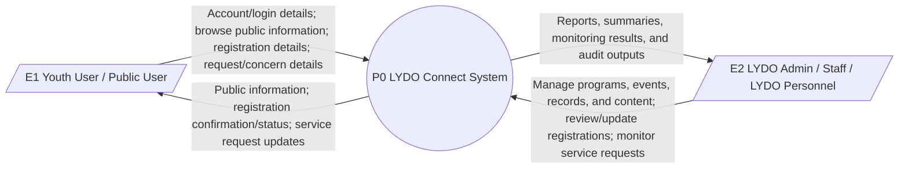
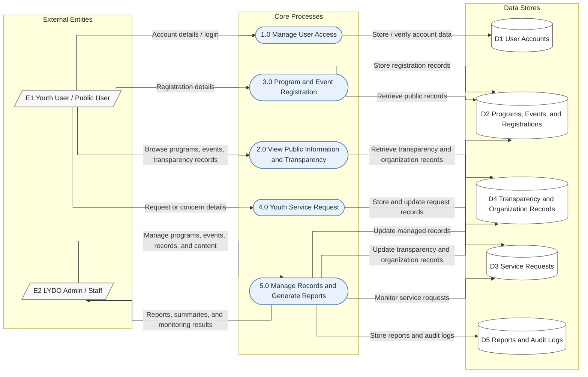
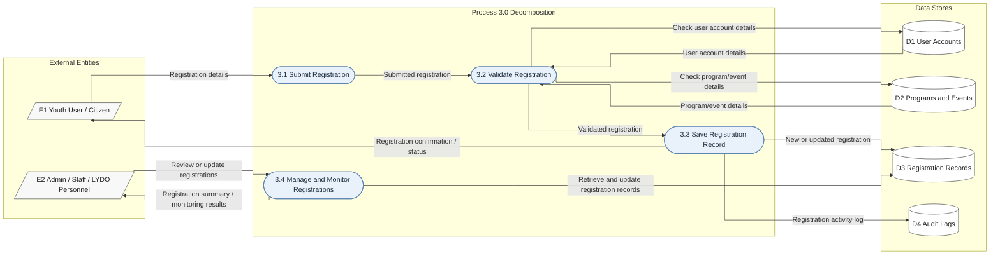

# Data Flow Diagram

## Overview

This section presents the Data Flow Diagram (DFD) of **LYDO Connect** in three levels: the **Context Diagram (Level 0)**, **DFD Level 1**, and **DFD Level 2 of Process 3.0 Program and Event Registration**. The updated diagrams follow the reduced data-store scope from the latest draft and focus on user access, public information, registration flow, youth service requests, and admin monitoring/reporting.

## External Entities

- `E1` Youth User / Public User
- `E2` LYDO Admin / Staff / LYDO Personnel

## Context Diagram (Level 0)

*Figure 1: Context Diagram*

## Data Flow Diagram Level 1

### Major Processes

- `1.0` Manage User Access
- `2.0` View Public Information and Transparency
- `3.0` Program and Event Registration
- `4.0` Youth Service Request
- `5.0` Manage Records and Generate Reports

### Data Stores (Reduced)

- `D1` User Accounts
- `D2` Programs, Events, and Registrations
- `D3` Service Requests
- `D4` Transparency and Organization Records
- `D5` Reports and Audit Logs

*Figure 2: Data Flow Diagram Level 1*

### Data Flow Diagram Level 1 Process Description

The DFD Level 1 provides a more detailed view of the updated LYDO Connect scope using five core processes and reduced data stores (up to `D5`). It shows how user requests and admin management actions are processed, stored, and monitored.

### Manage User Access (1.0)

- Youth/public users submit account details or login information.
- The process stores and verifies account data in `D1 User Accounts`.

### View Public Information and Transparency (2.0)

- Youth/public users browse programs, events, and transparency information.
- The process retrieves transparency and organization records from `D4 Transparency and Organization Records`.

### Program and Event Registration (3.0)

- Youth/public users submit registration details.
- Registration data is stored in `D2 Programs, Events, and Registrations`.
- Public registration-related records can also be retrieved from `D2` as needed.

### Youth Service Request (4.0)

- Youth/public users submit request or concern details.
- The process stores and updates request records in `D3 Service Requests`.

### Manage Records and Generate Reports (5.0)

- Admin/staff manages programs, events, records, and content.
- The process updates managed program/registration records in `D2`.
- The process updates transparency and organization records in `D4`.
- The process monitors service requests through `D3`.
- Reports and audit outputs are stored in `D5 Reports and Audit Logs`.
- Reports, summaries, and monitoring results are returned to admin/staff.

## Data Flow Diagram Level 2 of Process 3.0 Program and Event Registration

*Figure 3: Data Flow Diagram Level 2 of Process 3.0 Program and Event Registration*

### Data Flow Diagram Level 2 Process Description

The DFD Level 2 provides a more detailed view of **Process 3.0 Program and Event Registration**, building on the Level 1 diagram. It shows how registration details are submitted, validated against user and program/event records, saved in registration records, and monitored by admin/staff with corresponding audit logging.

### Program and Event Registration (3.0)

- Youth users/citizens submit registration details for LYDO programs and events.
- The process validates user account details and registration inputs.
- Program/event details are checked before saving registrations.
- New or updated registration records are stored.
- Admin/staff can review, update, and monitor registration results.
- Registration activity is recorded in audit logs.

### Submit Registration (3.1)

- Captures registration details submitted by youth users/citizens.
- Passes submitted registration data to validation.

### Validate Registration (3.2)

- Validates user account details and registration completeness.
- Checks program/event details before approval.

### Save Registration Record (3.3)

- Saves new or updated registration entries.
- Records registration activity logs.
- Sends registration confirmation or status to the youth user/citizen.

### Manage and Monitor Registrations (3.4)

- Allows admin/staff to review or update registration records.
- Produces registration summaries and monitoring results for admin/staff.
