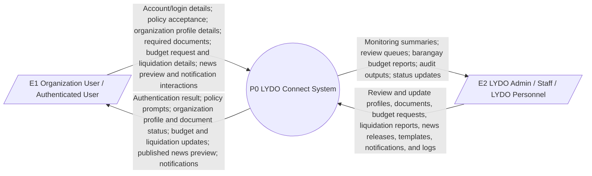
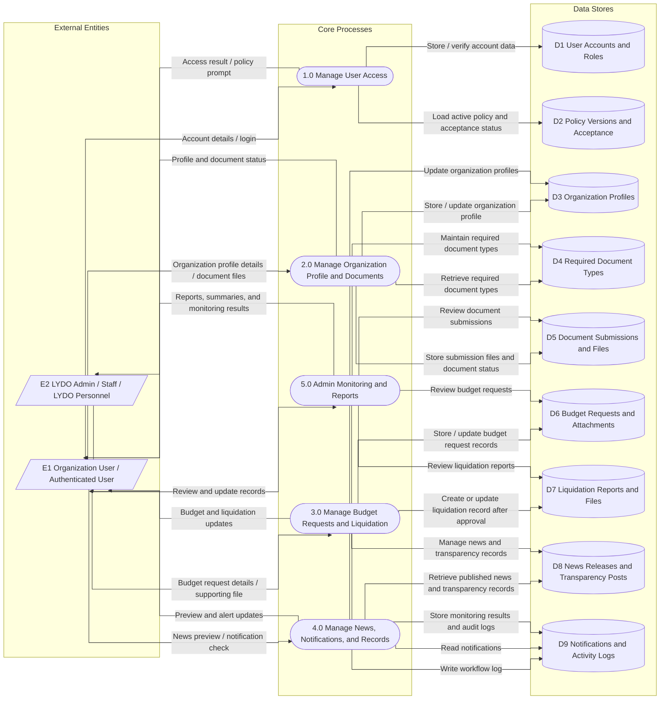
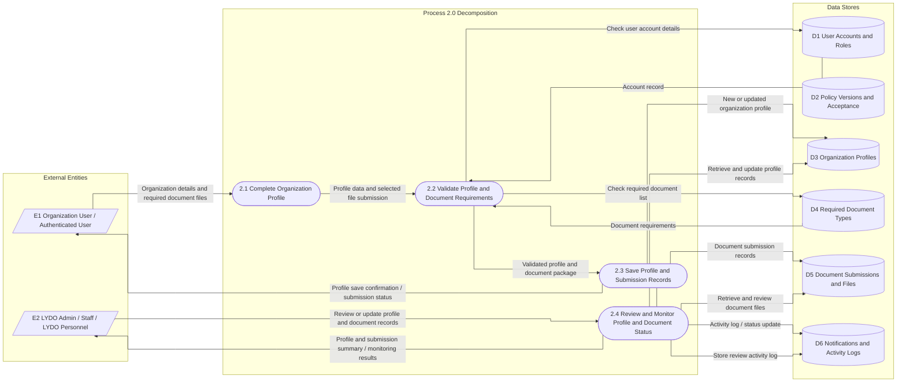

# Data Flow Diagram

This section presents the Data Flow Diagram (DFD) of LYDO Connect in three levels: the Context Diagram (Level 0), DFD Level 1, and DFD Level 2 of Process 2.0 Organization Profile and Document Submission. The diagrams follow the current site scope and focus on authenticated organization work, budget and liquidation processing, news previewing, notifications, and admin monitoring/reporting.

## External Entities

- `E1` Organization User / Authenticated User
- `E2` LYDO Admin / Staff / LYDO Personnel

## Figure 1. Context Diagram (Level 0)

## Figure 2. Data Flow Diagram Level 1

### Process 2.0 Organization Profile and Document Submission

The Level 1 DFD shows how authenticated organization users complete their organization profile and submit the required documents in LYDO Connect. The process uses the organization profile records, required document types, document submission files, and notification or activity log data to save updates and track submission status.

- Organization users enter profile details and upload required documents through the protected portal.
- The system checks the linked account, required document list, and profile completeness before saving records.
- Profile updates and submitted files are stored in the organization profile and document submission data stores.
- Submission activity and status changes are recorded in the notifications and activity log store.
- Admin or staff users can review the saved profile and submitted documents for monitoring and follow-up.

### Level 1 Process Breakdown

The Level 1 DFD presents the main LYDO Connect workflow in five core processes. It shows how user access, public information viewing, profile and document submission, budget and liquidation handling, and admin monitoring are connected to the appropriate data stores.

- `1.0 Manage User Access`
  - Youth or public users submit account details or login information to enter the system.
  - The process verifies the account data and stores it in the user account records before returning the access result to the user.

- `2.0 View Public Information and Transparency`
  - Youth or public users browse programs, events, and transparency information available in the system.
  - The process retrieves the published transparency and organization records needed for public viewing.

- `3.0 Program and Event Registration`
  - Youth or public users submit registration details for available programs and events.
  - The process stores registration data in the registration records and can retrieve public registration-related information when needed.

- `4.0 Youth Service Request`
  - Youth or public users submit request or concern details through the system.
  - The process stores and updates the request records so the submitted concerns can be tracked and reviewed.

- `5.0 Manage Records and Generate Reports`
  - Admin or staff users manage programs, events, records, and content in the system.
  - The process updates the stored records, monitors service requests, and generates reports and audit outputs for review and monitoring.

## Figure 3. Data Flow Diagram Level 2 of Process 2.0 Organization Profile and Document Submission

### Process 2.0 Decomposition

The Level 2 DFD breaks Process 2.0 into smaller actions that reflect the actual organization profile and document submission workflow in the system.

- `2.1 Complete Organization Profile`
  - The organization user enters or updates the profile details linked to the account, including the organization name, contact information, address, classification, adviser, representative, and other required profile fields.

- `2.2 Validate Profile and Document Requirements`
  - The system validates the account-linked profile data and checks the required document list before allowing the submission to proceed.
  - This step helps ensure that the profile is complete and that the selected file matches the expected document type.

- `2.3 Save Profile and Submission Records`
  - The system stores the updated organization profile, saves the uploaded document record, and records the submission activity.
  - After saving, the system returns a confirmation or status update to the organization user.

- `2.4 Review and Monitor Profile and Document Status`
  - Admin or staff users review the saved organization profile and submitted documents.
  - They update review status when needed and monitor the results through the stored profile, submission, and activity log records.

## Data Flow Summary

1. Organization users enter the system through authentication, policy acceptance, and role-based access.
2. Organization profile data and required documents are validated before being stored and reviewed.
3. Budget requests and liquidation reports are handled as linked workflow records after the profile and document stage.
4. Published news releases, transparency posts, and notifications are retrieved for preview and alert purposes.
5. Admin staff review records, maintain reference data, and generate monitoring outputs and audit logs.

## Scope Note

The DFD matches the current LYDO Connect workflow and intentionally excludes legacy program/event registration and other earlier-draft public-visitor flows.
